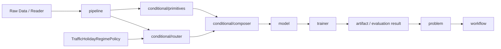
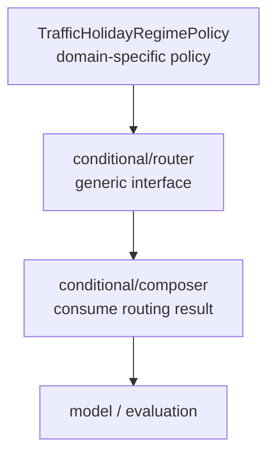
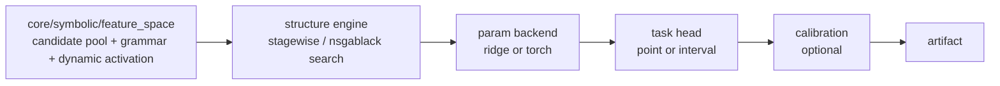
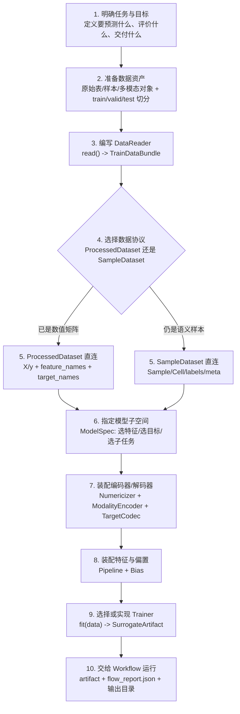
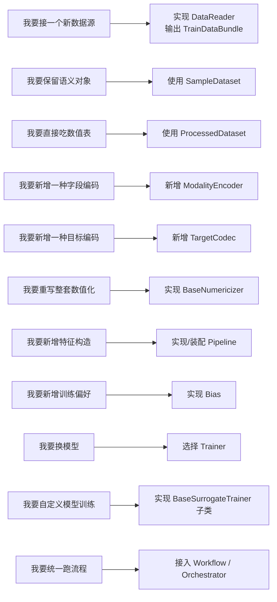
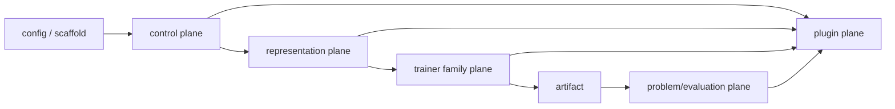

# mlblack 框架总览（2026-04）

## 1. 一句话定义
`mlblack` 是一个面向 `SurrogateArtifact` 输出的机器学习装配框架：
- 不重造底层算法库；
- 重点做概念分层、语义到数值转换、训练器可插拔、产物可追溯；
- 作为 `nsgablack` 外层优化链条中的“可替换 surrogate 供应层”。

---

## 2. 为什么要有 mlblack
你的实际问题不是“再写一个模型”，而是“把机器学习变成可复用模块，稳定接入优化全链条”。

典型痛点：
1. 数据语义和训练数值混在一起，后期改一处牵一片。
2. 模型切换成本高（线性、树、神经网络、符号）且不可比较。
3. 训练结果不可追溯，难以复盘“为什么这版 surrogate 有效/无效”。
4. 很难和 `nsgablack` 做双向嵌套（外层调结构，内层训参数）。

`mlblack` 的核心价值就是把这些问题工程化拆开。

---

## 3. 目标与非目标

### 3.1 目标
1. 输出标准化 surrogate 工件（可保存/加载/预测）。
2. 保留语义完整性：先定义列/目标语义，再数值化。
3. 提供统一训练主流程，后端可替换。
4. 支持实验追踪与可审计（flow report + artifact metadata）。
5. 与 `nsgablack` 无缝协作。

### 3.2 非目标
1. 不与 PyTorch / XGBoost / sklearn 争底层生态。
2. 不做“自动清洗一切数据”的万能 ETL 平台。
3. 不承诺单一模型在全部任务最优。
4. 不是 LLM 应用框架。

---

## 4. 当前能力地图（已落地）

补充执行稿：

- `nowcasting_work_ci/docs/README_RUNTIME_CONTRACTS.md`
  - 固定了 runtime stage 输入输出
  - 固定了 context key
  - 固定了 plugin/hook 副作用边界
  - 固定了复现性种子路径

### 4.1 组件注册（Registry）
当前默认注册项：
- `pipelines`: `identity`, `zscore`
- `biases`: `noop`, `l2_scale`
- `numericizers`: `default`
- `trainers`: `ridge`, `random_forest`, `extra_trees`, `bagging`, `adaboost`, `xgboost`, `sklearn_mlp`, `mlp_torch`, `symbolic`, `symbolic_torch`, `symbolic_stagewise`, `symbolic_torch_interval`

描述层统一出口：
- `config.describe_trainers()`：
  - 返回每个 trainer 的 `registry + capabilities + contract`
  - 其中 `contract` 是给 UI / 脚手架 / 文档读取的稳定结构
- `config.describe_registered()`：
  - `trainers[*].metadata.trainer_contract` 内嵌同一份 contract 投影
  - 适合做“注册表视角”的组件清单展示

### 4.2 数据协议
- 支持两类输入协议：
  - `SampleDataset`（语义样本）
  - `ProcessedDataset`（数值矩阵）
- 同一 workflow 自动兼容两种输入路径。

### 4.3 数值层能力
- 强类型 numericizer：`DefaultNumericizer`
- `TargetCodec`：numeric / binary / categorical
- 支持目标编码与解码闭环。

### 4.4 输出能力
- 统一输出 `SurrogateArtifact`
- 同时输出 `flow_report.json`（指标、装配、元信息）

### 4.5 `family -> preset -> head` 正式能力矩阵

这里不再用“代表性入口表”，而是把当前已经落地的
`family -> preset -> head -> continuation surface`
正式摊开。

这张表专门区分四件事：

1. 主训练骨架属于哪个 `family`
2. 当前对外暴露的是哪个 `preset / entry`
3. 最终输出挂的是哪个 `head`
4. continuation 语义到底落在哪一层

不要把这四者混为一谈。

| `family` | 当前 `preset / entry` | 当前已落地 `head` | backend | 数据/装配底座 | `fit_task` 统一入口 | `trainer_state + save/load` | `resume` | `warm_start` | `incremental` | `symbolic structure_engine` 关系 |
| --- | --- | --- | --- | --- | --- | --- | --- | --- | --- | --- |
| `linear family` | `ridge` | `point` | `numpy` | 已接入 | 已接入 | 已接入 | 支持，语义为 `closed_form_refit` | 支持，语义为 `closed_form_refit` | 支持，语义为 `closed_form_refit` | 不属于 |
| `tree family` | `random_forest` | `point` | `sklearn` | 已接入 | 已接入 | 已接入 | 支持，语义为 `sklearn_warm_start_append` | 支持，语义为 `sklearn_warm_start_append` | 支持，语义为 `sklearn_warm_start_append` | 不属于 |
| `tree family` | `extra_trees` | `point` | `sklearn` | 已接入 | 已接入 | 已接入 | 支持，语义为 `sklearn_warm_start_append` | 支持，语义为 `sklearn_warm_start_append` | 支持，语义为 `sklearn_warm_start_append` | 不属于 |
| `tree family` | `bagging` | `point` | `sklearn` | 已接入 | 已接入 | 已接入 | 支持，语义为 `sklearn_warm_start_append` | 支持，语义为 `sklearn_warm_start_append` | 支持，语义为 `sklearn_warm_start_append` | 不属于 |
| `tree family` | `adaboost` | `point` | `sklearn` | 已接入 | 已接入 | 已接入 | 暂未支持，当前语义为 `fresh_only` | 暂未支持，当前语义为 `fresh_only` | 暂未支持，当前语义为 `fresh_only` | 不属于 |
| `tree_boosting family` | `xgboost` | `point` | `xgboost` | 已接入 | 已接入 | 已接入 | 支持，基于 `xgb_model` continuation | 支持 | 支持 | 不属于 |
| `neural family` | `sklearn_mlp` | `point` | `scikit-learn` | 已接入 | 已接入 | 已接入 | 暂未支持 | 支持，基于 sklearn estimator reuse | 暂未支持 | 不属于 |
| `neural family` | `mlp_torch` | `point` | `pytorch` | 已接入 | 已接入 | 已接入 | 支持，基于 epoch checkpoint / trainer_state 恢复 | 暂未支持 | 暂未支持 | 不属于 |
| `symbolic family` | `symbolic` facade | `point`（当前默认 facade） | `numpy` | 已接入 | 已接入 | 已接入 | 支持，语义为 `seeded_structure_restart` | 支持，语义为 `reuse_parent_genome_as_seed` | 支持，语义为 `reuse_parent_genome_as_seed` | 属于；当前 facade 仍偏 stagewise symbolic |
| `symbolic family` | `symbolic_stagewise` | `point` | `numpy` | 已接入 | 已接入 | 已接入 | 支持，语义为 `seeded_structure_restart` | 支持，语义为 `reuse_parent_genome_as_seed` | 支持，语义为 `reuse_parent_genome_as_seed` | 属于；`structure_engine` 主导 preset |
| `symbolic family` | `symbolic_torch` | `point` | `pytorch` | 已接入 | 已接入 | 已接入 | 支持 | 支持 | 支持 | 属于；`parameter_backend=torch` 主导 preset |
| `symbolic family` | `symbolic_torch_interval` | `interval` | `pytorch` | 已接入 | 已接入 | 已接入 | 支持 | 支持 | 支持 | 属于；`interval head` + symbolic search / warmup |

当前这张正式矩阵还顺手暴露了两件很重要的事实：

1. 目前真正已经正式落地的 `head`，主要是 `point` 与 `interval`。
2. `quantile / distribution / classification logits` 更应该被继续实现成 `head` 扩展，而不是误写成新的算法目录。

这张表对应的设计原则是：

1. 所有 `family / preset` 都应该共享 `workflow / training contract / plugin persistence`。  
2. `head` 决定的是输出语义，不应该被误判成新的 `family`。  
3. `symbolic structure_engine` 是 `symbolic family` 的主语义，不是所有 trainer 的公共前置步骤。  
4. `linear / tree / tree_boosting / neural family` 都可以与 symbolic 协同，但正确方式应当是：
   - symbolic 产结构
   - 或 symbolic 产特征
   - 其它 family 消费这些结果
   而不是把所有 family 都硬改成“自己会搜 AST”。  

---

## 5. 核心架构：解耦与语义边界

标准链路：

`data reader -> schema/view -> numericizer -> pipeline -> bias -> trainer -> artifact`

在训练器内部（尤其 torch 系），首轮已落地四组件拆分：
1. `HypothesisSpace`（Model / 假设空间）：定义 `y = f(W, X)` 结构。
2. `TrainingObjective`（Loss / 评价函数）：定义误差与惩罚（如 `mse` / `pinball`）。
3. `OptimizerSpec`（Optimizer / 参数更新策略）：定义 `W` 如何更新（`adamw/adam/sgd/rmsprop`）。
4. `BatchStreamSpec`（DataLoader / 批数据流）：定义 batch 切分与喂数行为。

这四个组件在代码上由 `core/hypothesis_space.py`、`core/loss_objective.py`、
`core/param_optimizer.py`、`core/batch_stream.py` 承载，并接入了
`mlp_torch`、`symbolic_torch`、`symbolic_torch_interval`。

边界规则：
1. 语义层（schema/numericizer）负责“这个格子是什么”。
2. 数值层（pipeline/trainer）负责“如何训练与预测”。
3. `artifact` 负责“如何稳定交付给外层系统”。

为了防止层次串线，semantic flow 已加硬校验：
- `validate_flow_assembly(...)` 会阻止把 numericizer 相关参数偷偷塞进 `trainer_params`。
- 语义配置必须留在 `assembly.numericizer.params`。

这点就是你说的“语义完整性”在工程上的约束化落地。

### 5.1 条件符号层：为什么不能让 trainer 知道 regime

当我们开始做更复杂的符号学习结构时，真正需要抽出来的并不只是一个 `regime` 组件，而是一整层“条件结构（conditional symbolic）”。

原因很简单：

1. `trainer` 只应知道“训练一个任务”，不应知道这是节假日分支、周末分支，还是某个标签门控。
2. `pipeline` 只应知道“把原始字段加工成可用特征”，不应决定这些特征最终是走分流还是进公式。
3. `problem` 只应知道“解码决策并触发评估”，不应在内部硬写某种条件建模策略。

因此，条件性必须被拆成三个正交层：

1. `conditional/router`
- 负责样本级条件。
- 回答“这一行样本应该走哪个 branch / regime”。
- 典型对象：`RegimePolicy`、`TrafficHolidayRegimePolicy`。

2. `conditional/primitives`
- 负责公式级条件。
- 回答“某个条件变量如何进入公式本体”。
- 典型原语：`0/1 gate`、`one-hot gate`、`max(0, x-c)`、`soft_step(x-c)`、`hinge * feature`。

3. `conditional/composer`
- 负责结构级组合。
- 回答“是先 route 再 fit，还是 shared backbone + regime residual，还是 route 与 hinge/gate 嵌套”。
- 它是条件结构的装配器，而不是训练器本身。

一句话说：

- `router` 决定样本走向；
- `primitives` 决定公式形状；
- `composer` 决定它们怎样套娃；
- `trainer` 只负责训练。

### 5.2 更硬的组件图

下面这张图描述的是推荐的正式结构，而不是把逻辑散落到若干 `utils.py` 里。



这张图里每个节点的职责是：

- `pipeline`
  - 产出基础特征、lag 特征、drop/cross 后的矩阵。
  - 只提供“可被条件层消费的材料”。

- `conditional/router`
  - 对样本做离散分流。
  - 输出 `regime key`、`branch assignment`、`sample mask`。

- `conditional/primitives`
  - 对特征做门控/分段表达。
  - 输出可放入 DSL 或 candidate pool 的条件项。

- `conditional/composer`
  - 把 `router` 与 `primitives` 装成完整结构。
  - 输出一个“可训练的结构化任务”。

- `model`
  - 承载组合后的模型定义，例如：
    - `shared backbone`
    - `regime residual heads`
    - `route-then-symbolic`
    - `global symbolic + gated terms`

- `trainer`
  - 只接收任务、矩阵、目标、配置并训练。
  - 不知道节假日、不知道 strict4、不知道 hinge 是业务门控还是标签门控。

- `problem`
  - 只负责把优化器决策解码成一个待评估结构。
  - 不负责“发明条件结构”，只调用现成的 composer/evaluator。

- `workflow`
  - 只编排 stage：读数据、装配条件结构、训练、评估、导出。

### 5.3 目录图：推荐落位

如果把这套三层正式落到 `mlblack` 根层，目录建议如下：

```text
mlblack/
  conditional/
    router/
      __init__.py
      base.py
      resolution.py
      policy.py
      fixed_k_router.py

    primitives/
      __init__.py
      base.py
      binary_gate.py
      onehot_gate.py
      hinge.py
      step.py
      piecewise.py
      soft_gate.py

    composer/
      __init__.py
      base.py
      spec.py
      route_then_formula.py
      shared_backbone_residual.py
      route_plus_primitives.py

  pipeline/
    feature_space_builder.py
    ...

  model/
    interval_fit.py
    shared_backbone.py
    regime_residual.py
    shared_regime_symbolic.py
    ...

  evaluation/
    problem_callbacks.py
    ...

  problem/
    bridge.py
    proxy.py
    ...

  workflow/
    orchestrator.py
    hook_bus.py
    ...
```

这里要特别强调：

1. `conditional/router`
- 放的是“样本级条件接口与通用解析逻辑”。
- 不放交通、金融、制造这类领域硬编码。

2. `conditional/primitives`
- 放的是“公式级条件原语”。
- 它们是 DSL / grammar / candidate pool 的公共积木。

3. `conditional/composer`
- 放的是“结构组合范式”。
- 它不是具体训练器，也不是某个单一场景脚本。

### 5.4 与现有 mlblack 分层的一一对齐

可以用下面这张表来避免再把逻辑塞错层。

| 条件层 | 核心问题 | 在现有 mlblack 中应对齐到哪层 | 不该落在哪 |
| --- | --- | --- | --- |
| `conditional/router` | 样本走哪条支路 | `bias / router policy / evaluation branch resolution` | `trainer`、`artifact` |
| `conditional/primitives` | 条件如何进入公式 | `pipeline + symbolic feature space + DSL primitives` | `workflow`、`problem shell` |
| `conditional/composer` | route 与公式如何套娃 | `model + evaluation` | `trainer`、`reader` |

再翻译成你更关心的框架语言：

1. `pipeline`
- 提供字段与加工后的特征。
- 例如：`a`、`b`、`a_lag1`、`b_lag3`、shock flag。

2. `conditional/router`
- 决定“按 `a` 做 regime 分流”。

3. `conditional/primitives`
- 决定“按 `b` 做 0/1 gate、hinge、soft-step 还是 one-hot”。

4. `conditional/composer`
- 决定结构是：
  - `RouteBy(a) -> branch formula with gate(b)`
  - `shared_backbone(x) + residual_by_regime(a, gate(b))`
  - `global formula + conditional terms from b`

5. `trainer`
- 不关心上面三者是谁，只训练被装配好的任务。

6. `problem`
- 只负责把优化向量变成：
  - 选了哪些 candidate
  - 用了哪些 primitive family
  - 采用哪种 composer spec

7. `workflow`
- 只负责编排顺序，不发明建模语义。

#### 5.4.1 自动化边界：哪些可辅助，哪些必须显式声明

这里必须把一条原则写死：

`mlblack` 是框架，不是黑箱产品。

因此它的自动化策略不应是“系统替用户做建模决策”，而应是：

`显式声明优先 -> 辅助推荐其次 -> 自动默认可选`

也就是说：

1. 框架可以帮助用户更快装配；
2. 但不能偷偷替用户决定语义归属；
3. 更不能在底层悄悄切换建模范式。

如果把这条原则翻译成工程约束，可以得到下面这张表：

| 对象 | 是否允许自动化 | 正确方式 | 不正确方式 |
| --- | --- | --- | --- |
| 字段是否属于 `router` | 可辅助，不可强判 | 用户在 `config/assembly` 显式声明，框架可给 heuristic suggestion | 底层看到列名像 `is_*` 就强行改成 router |
| 字段是否属于 `onehot_gate` | 可辅助，不可强判 | 用户声明类别列进入 `conditional/primitives` 的哪一类 | numericizer 或 trainer 偷偷把字符串类别直接改造成 gate |
| 字段是否属于 `threshold_features` | 可辅助，不可强判 | 用户先声明“这列允许走阈值机制”，框架再提供 auto-cut | 系统看到连续列有波动就一律自动做 hinge/piecewise |
| `threshold cut` 的具体位置 | 允许自动化 | 在“角色已声明”的前提下，用 quantile / change-point / residual signal 辅助出 cut | 在没有角色声明时，直接替用户定义“这列一定该分段” |
| `multiplier_feature` 的搭配 | 可辅助，不可偷定 | 框架可以给推荐搭配，如 `ci_lag1 -> avg_speed_lag1`，但允许覆盖/关闭 | 把领域耦合搭配硬编码死在 core，不允许替换 |
| `composer mode` 选择 | 原则上必须显式声明 | 用户选 `route_then_formula / route_plus_primitives / shared_backbone_regime_residual` | workflow 或 trainer 根据数据形状偷偷切换 composer |
| `family / preset / head` 选择 | 必须显式声明 | 用户先决定 `linear / tree / tree_boosting / neural / symbolic family`，再决定具体 preset，必要时再决定 `point / interval` 等 head | 条件层语义反向污染 trainer，让 trainer 自己猜结构 |
| 动态扩池家族激活 | 可辅助 | 在用户已经选定 family 的前提下，由 residual/gradient 决定何时扩这一族 | 扩池器绕过用户意图，自己发明全新的结构范式 |

这张表背后的思想非常重要：

1. “是否允许某种结构存在”是用户的权力。
2. “在已允许的结构空间里如何更聪明地搜索”才是框架自动化的权力。

换句话说：

- `role assignment` 更接近语义声明；
- `cut proposal / family activation / residual expansion` 更接近搜索加速；
- 前者不能偷做，后者可以辅助做。

所以，正确的层间职责应该是：

1. `schema / config / assembly`
- 决定：
  - 哪些列是 `router features`
  - 哪些列是 `onehot_gate features`
  - 哪些列是 `threshold_features`
  - 默认启用哪种 `composer`

2. `conditional/router`
- 只消费已经声明为 router 的字段。
- 不自己“发明”某列是不是 router。

3. `conditional/primitives`
- 只消费已经允许进入公式的条件列。
- 可以在许可范围内自动生成：
  - gate
  - hinge
  - soft-step
  - piecewise
  - auto-cut variants

4. `conditional/composer`
- 只装配已经被允许的结构范式。
- 不根据训练误差偷偷把 `route_then_formula` 改成 `shared_backbone_regime_residual`。

5. `trainer`
- 永远不拥有条件语义解释权。
- 它只训练被装配好的任务。

因此，今后凡是新增自动化能力，都应该先问两个问题：

1. 它是在“猜用户想建什么模型”吗？
如果是，那就不该默认自动执行，而应变成显式配置或 suggestion。

2. 它是在“用户已允许的结构空间内帮忙提速/提效”吗？
如果是，那就适合做成 auto helper、policy、dynamic expansion 或推荐器。

最后把这条边界压缩成一句最重要的框架规则：

`mlblack` 可以自动帮助搜索，但不应自动替用户定义问题。

### 5.5 TrafficHolidayRegimePolicy 放在哪里

`TrafficHolidayRegimePolicy` 的定位必须说死：

- 它是 `conditional/router` 的一个领域实现；
- 它不是 `conditional/primitives`；
- 它也不是 `composer`；
- 更不是 `trainer`。

所以它和根层组件的关系应该是：



结合当前代码状态，可以理解为：

1. 当前通用 router 接口
- 已经在 `core.symbolic.feature_space.regime_router` 这条链上成形。

2. 当前场景实现
- `nowcasting_work_ci/mlblack_side/problem/domain_router.py`
- 里面的 `TrafficHolidayRegimePolicy` 负责把交通节假日字段映射到规范 regime key。

3. 当前消费方
- `bias/branch_policy.py`
- `evaluation/problem_callbacks.py`
- `nowcasting_work_ci/mlblack_side/problem/problem_model.py`

因此，`TrafficHolidayRegimePolicy` 的正确理解不是“整个条件系统”，而是：

- “条件系统里样本级分流的一种场景 policy”

### 5.6 你说的“套娃”如何被正式表达

你提出的这类结构：

- 对 `a` 做 regime；
- 对 `b` 既可能作为 `0/1` 特征进入公式；
- 也可能作为 `max(0, b-c)` 这种分段项；

最适合被表达为下面这种组合：

```text
RouteBy(a_regime)
  -> BranchFormula(
       base_features = x,
       gated_terms = [indicator(b), onehot(b)],
       piecewise_terms = [max(0, b-c), max(0, c-b), soft_step(b-c) * z]
     )
```

或者：

```text
shared_backbone(x)
  + residual_by_regime(
      regime = route(a),
      terms = [indicator(b), hinge(b-c), soft_gate(b-c) * z]
    )
```

这两种表达都说明同一件事：

- `a` 的条件性属于样本级路由；
- `b` 的条件性属于公式级原语；
- 二者的嵌套关系属于 composer；
- trainer 仍然只是训练。

### 5.7 这套设计和当前五层的对应关系

为了后续架构讨论不跑偏，可以把它压缩成一句更硬的映射：

```text
workflow
  -> 负责编排何时装配 conditional 结构

problem
  -> 负责把优化决策翻译成 conditional spec

pipeline
  -> 负责提供可被 route / gate / hinge 消费的特征材料

model
  -> 负责承载 composer 产出的结构化模型

trainer
  -> 负责训练，不承担条件语义
```

这就是为什么 `conditional/router`、`conditional/primitives`、`conditional/composer`
应当被视为一套独立的中间层：它们既不属于纯数据层，也不属于纯训练器层，而是
`mlblack` 在“结构表达能力”上的核心扩展面。

### 5.8 现状组件到目标三层的迁移表

为了避免“嘴上说三层，代码里还是到处乱放”，下面把当前已经存在的关键模块和目标落位对应起来。

| 当前模块 | 当前职责 | 目标落位 | 当前状态 |
| --- | --- | --- | --- |
| `core/symbolic/feature_space/regime_router.py` | 固定/兼容式 regime key 解析、gate 索引解析 | `conditional/router` | 已出现主干语义，但仍带 `strict4/fixed4` 历史形状 |
| `bias/branch_policy.py` | branch policy 到 router resolution 的装配 | `conditional/router` 的装配边界 | 部分对齐 |
| `nowcasting_work_ci/mlblack_side/problem/domain_router.py` | 交通节假日场景 policy | `conditional/router` 的场景实现 | 已对齐，现已可导出 generic adapter |
| `core/symbolic/feature_space/primitive_registry.py` | 条件/非条件原语注册 | `conditional/primitives` 的 registry 基座 | 部分对齐 |
| `core/symbolic/feature_space/generation_grammar.py` | 原语组合、候选生成语法 | `conditional/primitives` + `conditional/composer` 边界 | 尚未正式迁出 |
| `core/symbolic/feature_space/candidate_pool.py` | primitive family 激活、残差扩池、候选剪枝 | `conditional/primitives` 的执行层 | 部分对齐 |
| `core/symbolic/feature_space/branch_evaluator.py` | global/regime fold 执行、fallback、branch 预测 | `conditional/composer` 的评估执行面 | 部分对齐 |
| `evaluation/problem_callbacks.py` | fit / interval / summary 回调装配 | `conditional/composer` 到 `evaluation` 的桥 | 部分对齐 |
| `model/interval_fit.py` | 具体拟合与区间构造 | `model`，供 composer 调用 | 已在正确层，但尚未显式接 composer spec |
| `nowcasting_work_ci/mlblack_side/problem/problem_model.py` | 决策解码后触发条件评估 | `problem` 薄壳，消费 composer/evaluator | 正在瘦身中 |
| `workflow/orchestrator.py` | stage 编排 | `workflow` 控制平面 | 已在正确层，不承载条件语义 |

这张表要表达的重点不是“今天就把所有文件都搬走”，而是：

1. 以后再出现样本级分流逻辑，默认先问自己它是不是该进 `conditional/router`。
2. 再出现 `0/1 gate`、`hinge`、`step`、`piecewise` 这类表达，默认先问自己它是不是该进 `conditional/primitives`。
3. 再出现“先 route 再公式”或“shared backbone + regime residual”这类套娃结构，默认先问自己它是不是该进 `conditional/composer`。

如果一个新逻辑同时碰到了：

- 样本分流；
- 公式原语；
- 结构组合；

那它大概率就不该直接落进 `trainer`，也不该直接塞进 `problem_model.py`。

### 5.9 这套组合拳如何覆盖主要数据机制

这里说的“通吃全部数据”，不应理解为“完全零配置、完全不用领域判断”，而应理解为：

- 只要数据最终能通过 `schema / numericizer / pipeline` 进入可训练表征；
- 并且它的核心行为机制能被拆成“状态切换 / 条件激活 / 连续平滑 / 局部突变”中的一种或几种；

那么这套 `router + primitives + backbone + composer` 的组合拳就能给出统一的结构表达。

换句话说，它想解决的不是“所有数据长得一样”，而是“不同数据机制最终都能落到同一套结构化装配语义里”。

#### 5.9.1 无序离散数据：宏观状态走 router，微观开关走 gate

无序离散数据最常见的两种作用方式，其实完全不同：

1. 宏观状态集
- 例如：`疫情期 / 正常期`
- 例如：`工作日 / 长假 / 周末`
- 例如：`设备处于模式 A / B / C`

这类变量的含义不是“给公式多加一列”，而是“系统已经换了一个运行状态空间”。
因此最合适的表达就是 `conditional/router`：

- 由 `router` 决定样本落到哪个 branch；
- branch 之间的计算图、权重、残差修正都可以隔离；
- 这属于“物理分流”，不是简单的 one-hot 列增强。

这就是 `TrafficHolidayRegimePolicy` 这类对象最自然的定位：

- 它不是训练器；
- 它不是 primitive；
- 它只是“把样本送进不同状态空间”的样本级路由器。

2. 微观开关集
- 例如：`是否下雨`
- 例如：`是否施工`
- 例如：`是否告警`

这类变量未必需要把整体样本空间硬切成多个分支，因为它的作用常常只是：

- 在某个条件成立时，激活一类额外效应；
- 不成立时，该效应消失。

因此它更适合进入 `conditional/primitives`：

```text
I(rain) * f(X)
I(alarm) * g(X)
onehot(mode=k) * h(X)
```

这类结构的优势是：

- 主公式仍然统一；
- 只有局部项被条件激活；
- 比“把整个数据集切碎成很多小分支”更稳。

一个很重要的工程判断是：

- 大状态切换，用 `router`
- 小条件开关，用 `gate / onehot_gate`

不要把这两类东西混成同一种机制。

#### 5.9.2 连续但有阈值截断的数据：hinge / piecewise 吃掉非光滑拐点

很多工业和科研数据的难点，不在于“连续”，而在于“连续但带阈值”：

- 水位超过警戒线后泄洪机制突变
- 电价超过某个档位后计费规则跳变
- 负荷超过容量后损耗斜率变大
- 速度低于阈值和高于阈值时阻力规律不同

如果拿一个纯光滑多项式去拟合这种关系，常见问题是：

1. 为了逼近拐点，模型会出现大幅振荡；
2. 模型虽然在局部插值，但物理解释很差；
3. 外推时非常危险。

这正是 `conditional/primitives` 中 `hinge / piecewise / step / soft_gate` 的价值：

```text
w * max(0, 水位 - 警戒线)
w1 * max(0, x - c) + w2 * max(0, c - x)
soft_step(x-c) * z
```

这些原语的核心意义不是“多加几个函数”，而是：

- 直接把阈值性写进结构；
- 不逼着平滑函数去假装自己能优雅表达非光滑机制；
- 让模型更接近真实物理或业务规则。

也就是说：

- 连续平滑关系，不强迫用 piecewise；
- 阈值截断关系，也不强迫用高阶多项式；

不同机制走不同结构，这是这套架构的关键审美。

#### 5.9.3 连续平滑 / 周期性数据：symbolic backbone 负责大众规律

还有一大类数据，其主要关系是平滑、连续、可展开、可叠加的：

- 温度变化
- 速度衰减
- 时间周期
- 自然振荡
- 常规交互乘积项

这类关系最适合交给底层 `symbolic backbone` 去建模，也就是：

- `sin(x)`
- `cos(x)`
- `exp(-x)`
- `x^2`
- `x1 * x2`
- 更一般的递归组合 unary / pair primitives

这里 backbone 的角色不是去处理“条件突变”，而是去学习：

- 主体的平滑规律；
- 大多数样本共同遵守的公共方程；
- 那些不需要 route、也不需要硬阈值的连续结构。

因此在结构职责上：

- `backbone` 吃平滑主效应；
- `router` 吃状态切换；
- `primitives` 吃条件激活与阈值拐点；

这三者不是竞争关系，而是各自负责一种不同的数学困难。

#### 5.9.4 Composer：把三类机制真正套成一个系统

真正让这套架构变强的，不是单独某一个组件，而是 `conditional/composer`。

因为很多真实系统并不是单一机制，而是多机制叠加：

- 有一个全局连续规律；
- 同时系统会因为状态不同而切到不同工作区间；
- 在每个区间里，又有一些开关项和阈值项只在局部激活。

这时最自然的结构不是单层公式，而是“套娃装配”：

```text
shared_backbone(x)
  + residual_by_regime(
      regime = route(a),
      terms = [indicator(b), hinge(b-c), soft_gate(b-c) * z]
    )
```

它的数学含义可以直白地拆开：

1. `shared_backbone(x)`
- 先拟合全局共享的大众规律；
- 所有样本共用这一层连续方程。

2. `route(a)`
- 再根据宏观状态变量 `a` 进入不同状态空间；
- 这里捕捉的是“状态切换”。

3. `indicator(b) / hinge(b-c) / soft_gate(b-c) * z`
- 最后在局部状态空间里，用开关与分段原语修正残差；
- 这里捕捉的是“局部条件激活”和“阈值非线性”。

因此它不是简单的“又一个模型”，而是一个分层结构声明：

- 全局层：学习共性
- 路由层：学习状态差异
- 原语层：学习局部触发机制

这就是为什么 `composer` 是这套理论的集大成者。

#### 5.9.5 一个更硬的统一表达

如果把上面的思想写成统一模板，可以压缩为：

```text
y
= shared_backbone(X_smooth)
+ residual_{route(X_state)}(
    X_smooth,
    gate(X_binary),
    piecewise(X_threshold)
  )
```

其中：

- `X_smooth`
  - 表示平滑、周期、连续主效应特征
- `X_state`
  - 表示决定宏观状态空间切换的离散变量
- `X_binary`
  - 表示进入公式的 0/1 或 one-hot 开关变量
- `X_threshold`
  - 表示需要 hinge / step / piecewise 处理的阈值型连续变量

这个模板的最大价值在于：

- 它不要求所有变量都被同一种模型机制解释；
- 它允许每类变量用最合适的结构表达自己；
- 最后再通过 composer 把这些表达合成一个完整系统。

从框架角度说，这正是 `mlblack` 这套设计最有潜力的地方：

- 它不是只会堆函数；
- 而是在尝试给“不同数据机制”分配不同的结构职责。

#### 5.9.6 统一 SymbolicTrainer family：理论上应当只有一套符号训练逻辑

这里需要把一个很关键的概念彻底说清楚：

`symbolic_stagewise`、`symbolic_torch`、`symbolic_torch_interval`
不应该被理解成三种互不相干的理论模型。

从框架设计上说，更合理的理解是：

- 只有一个 `SymbolicTrainer family`
- 它内部再拆成三个正交插槽
  - `structure engine`
  - `parameter backend`
  - `task head`

也就是说，符号学习真正不变的主线应当是：

```text
candidate pool / grammar / dynamic expansion
  -> structure search
  -> parameter fitting backend
  -> task head(point / interval)
  -> artifact
```

如果再写得更硬一点，就是：

1. `structure engine`
- 负责“找什么结构”。
- 这一层应该统一接住：
  - `primitive_registry`
  - `generation_grammar`
  - `candidate_pool`
  - `dynamic activation`
  - `nsgablack` / stagewise search

2. `parameter backend`
- 负责“给定结构后，参数怎么拟合”。
- 可以是：
  - `ridge / closed-form`
  - `torch / gradient-based`
  - 未来也可以是 `xgb residual`、`teacher distilled readout`

3. `task head`
- 负责“最终输出什么任务形态”。
- 可以是：
  - `point`
  - `interval`
  - 未来也可以是 `quantile bundle`、`distributional head`

4. `calibration`
- 不是独立 trainer 理论，而是 task head 之后的附加层。
- 例如：
  - `none`
  - `conformal`
  - `coverage-constrained recalibration`

所以，`interval` 本质上更像：

- 同一套符号结构；
- 同一个或相近的参数后端；
- 只是换成了上下界输出与区间目标函数。

它不应该天然长成一条完全平行的“第二套符号学习体系”。

#### 5.9.7 当前实现与目标形态的差异

当前仓库里暴露出来的是三个 concrete trainer 入口，但它们更像是“演化期入口”，不是最终 family 形态：

| 当前 trainer key | 当前真实职责 | 按 family 拆开后对应什么 | 状态 |
| --- | --- | --- | --- |
| `symbolic_stagewise` | 用候选池 + grammar + residual-guided search 找结构，再做参数拟合 | `structure engine=stagewise_search` + `parameter backend=ridge/inner-opt` + `task head=point` | 最接近目标形态 |
| `symbolic_torch` | 当前更像“直接生成 seed genome，再用 torch 优化参数” | `parameter backend=torch` 已成形，但 `structure engine` 仍未完全统一到 stagewise/nsgablack | 结构侧尚未收口 |
| `symbolic_torch_interval` | 当前是“interval head + torch 拟合”，并带可选 stagewise warmup | `task head=interval` 已成形，但结构入口仍不是统一主干 | 任务头已成形，结构侧尚未收口 |

这意味着：

1. 你从理论上说“应该只有一种符号训练器”，这是对的。
2. 但从当前代码上说，暂时还存在多个实现入口。
3. 这些入口真正的区别，不应该继续定义为“不同理论”，而应收口成：
   - 谁负责找结构
   - 谁负责拟合参数
   - 谁负责输出任务头

#### 5.9.8 推荐的最终收口形态

推荐的正式收口方式如下：

```text
SymbolicTrainerFamilySpec
  structure_engine = stagewise_search + nsgablack + feature_space
  parameter_backend = ridge | torch
  task_head = point | interval
  calibration = none | conformal | ...
```

再翻译成更贴近目录与代码的形式：



这张图的含义是：

- `feature_space` 负责“可搜索结构空间”
- `structure engine` 负责“在这个结构空间里找到公式”
- `param backend` 负责“把公式参数拟合出来”
- `task head` 负责“把输出组织成点预测还是区间预测”
- `calibration` 负责“对区间语义做最后修正”

所以未来最理想的用户入口不应长期停留在：

- `symbolic_stagewise`
- `symbolic_torch`
- `symbolic_torch_interval`

而应逐步过渡到一个统一的 family 声明，例如：

```text
trainer_key = symbolic
structure_engine = stagewise_search
parameter_backend = torch
task_head = interval
calibration = conformal
```

#### 5.9.9 当前三入口应该被看成 legacy facade

为了兼容已有实验脚本，现在保留多个 trainer key 是合理的。

但在架构语言上，应该把它们视为：

- `legacy facade`
- `preset entry`
- `family preset`

而不是长期的一等抽象边界。

换句话说：

1. `symbolic_stagewise`
- 是“结构搜索优先”的 family preset

2. `symbolic_torch`
- 是“torch 参数后端优先”的 family preset

3. `symbolic_torch_interval`
- 是“interval task head 优先”的 family preset

这三者都应最终回到同一个 `SymbolicTrainer family`。

#### 5.9.10 这件事为什么比继续再加一个 trainer 更重要

如果不先把 family 契约收口，后面继续堆功能会越来越乱：

- 一个地方加 `stagewise warmup`
- 一个地方加 `interval calibration`
- 一个地方加 `shared backbone residual`
- 一个地方加 `teacher -> symbolic distill`

最后看起来功能很多，但其实是很多并列脚本逻辑，而不是一个正交框架。

相反，如果先把 `SymbolicTrainer family` 立住，那么后续所有高级玩法都只是往同一骨架上接：

- `shared backbone + regime residual symbolic`
- `point -> interval recalibration`
- `teacher model -> symbolic residual`
- `torch backend warm_start from stagewise structure`

这才是“一个理论、多种实现插槽”的框架味道。

---

## 6. 三段式项目入口（nsgablack 风格）

脚手架现在默认生成三文件入口：

1. `config.py`（注册层）
- 维护 `TRAINER_PRESETS`。
- 维护默认策略与覆盖逻辑（如 `preset_key` + 局部 override）。
- 只处理“选什么、偏好什么”。

2. `assembly.py`（装配层）
- 读取配置。
- 调用 `resolve_payload(...)` 归一化。
- 构建 `ScaffoldSpec` 并执行 `run_project_scaffold(...)`。
- 只处理“怎么拼起来”。

3. `run_train.py`（执行层）
- CLI 参数入口。
- 调 `assembly.run_from_config(...)`。
- 只处理“触发运行与打印结果”。

这和 `nsgablack` 的“配置-装配-执行”职责分离是一致的。

补充两条这次已经代码化的硬约束：

1. `config.py / scaffold json` 现在可以直接声明 `train.execution`，它对应 `L0 execution substrate`，负责：
   - `backend`
   - `max_workers`
   - `fail_fast`
   - `gpu_strategy`
   - `gpu_devices`
   - `default_device`
   - 并且这些字段的正式枚举/默认值已经进入 `schema.EXECUTION_SPEC_SCHEMA` 与 scaffold 生成的 `schema/execution_schema.py`

2. flow / orchestrator 的运行报告现在都统一产出 `control_plane_contract`，其中显式包含：
   - `lifecycle_events`
   - `inner_runtime_events`

也就是说，`L0 怎么声明` 和 `control plane / inner runtime 怎么观测`，现在都已经不是散落约定，而是正式契约面。

---

## 7. 数据与语义：你关心的核心点

你强调的点是对的：
- 一个格子不一定是原子数值；
- 可能是标签、序列、图结构、矩阵块、文本片段等语义对象；
- 训练最终要进入数值空间，但不能在语义层先把意义抹掉。

`mlblack` 当前做法：
1. 先定义/读取语义样本。
2. numericizer 负责“保语义地数值化”。
3. trainer 接收统一矩阵接口，专注参数优化。

这保证“表达问题”和“求解问题”分层。

---

## 8. 训练 family 统一协议与差异

### 8.1 统一部分
所有 `family` 与其 `preset` 都共享类似主流程：
1. 数据进入（Sample 或 Processed）。
2. 需要时 numericizer 编码。
3. pipeline 变换。
4. bias 注入偏好。
5. `trainer.fit_task(...)`（legacy trainer 也可经 `fit(...)` bridge 接入）。
6. 输出 `SurrogateArtifact`。

### 8.2 差异部分
差异不应该先按“算法名”理解，而应先按 `family` 身份理解：
- `linear family`
  - 当前代表 preset：`ridge`
  - 关键词：固定线性骨架、闭式或近闭式参数拟合、快、稳、可解释。
- `tree family`
  - 当前代表 preset：`random_forest`、`extra_trees`、`bagging`、`adaboost`
  - 关键词：树型分裂 + ensemble aggregation，同一家族下主要是 ensemble/sampling/splitter 的组合差异。
- `tree_boosting family`
  - 当前代表 preset：`xgboost`
  - 关键词：boosting 主骨架、逐轮状态信号、additive aggregation。
- `neural family`
  - 当前代表 preset：`sklearn_mlp`、`mlp_torch`
  - 关键词：固定网络骨架 + 梯度优化；backend 可以不同，但主语义相近。
- `symbolic family`
  - 当前代表入口：`symbolic` facade + `symbolic_*` legacy presets
  - 关键词：结构搜索、candidate pool、grammar、可追溯表达式。

所以“流程一致、入口很多”并不矛盾：
- 流程是框架层稳定接口；
- `family` 是主训练骨架；
- `preset` 是同一 `family` 在 backend / mechanism / head 组合下的具体落点；
- `plugin` 不是训练器变体，而是报表、checkpoint、审计、复现等外挂能力。

---

## 9. Artifact：框架交付物的一等公民

`mlblack` 不是只输出一个临时模型对象，而是输出可交付工件：
1. 可预测接口（predict）。
2. 可持久化（save/load）。
3. 带元数据（训练配置、指标、维度、后端信息）。
4. 可被 `nsgablack` 直接消费。

这让 surrogate 成为“生产对象”而不是“脚本中间变量”。

---

## 10. Workflow：把训练变成可复用流程

框架提供两层 workflow：
1. `run_train_flow(...)`：标准训练编排。
2. `run_semantic_train_flow(...)`：语义完整编排（numericizer + trainer assembly）。

你可把任意数据读取器挂上来，只要返回 `TrainDataBundle` 即可。

---

## 11. 与 nsgablack 的协作关系

### 11.1 单向调用（常规）
- `mlblack` 训练 surrogate。
- `nsgablack` 把 surrogate 作为外层优化评估器。

### 11.2 反向嵌套（进阶）
- `nsgablack` 优化 `mlblack` 的结构超参（函数簇、惩罚、策略）。
- `mlblack` 在内层完成参数训练并返回指标。
- 形成外层结构优化 + 内层参数优化闭环。

这就是你一直在讲的“全流程链条”和“你用我、我用你”。

---

## 12. 你这条路线的独特性

你的路线不是“再做一个调包平台”，而是：
1. 把 surrogate 构建过程显式化、模块化、可追溯。
2. 把语义层和数值层强隔离，减少含混。
3. 给外层优化（尤其多目标）留结构接口。
4. 支持从固定函数簇走向动态函数簇搜索。

这在主流工程里不算大众路线，但非常适合“问题驱动 + 优化闭环”的研究型工程。

---

## 13. 当前边界与已知限制

1. 图/序列等复杂结构编码仍需更系统的 encoder 插件化。
2. 部分 `family / preset` 对 sample_weight/多任务支持程度不同。
3. 默认脚手架偏“处理后表格数据”，上游清洗仍由你掌控。
4. DSL 还未正式落地（目前是 Python 配置装配）。

这些都属于可迭代边界，不是架构缺陷。

---

## 14. 推荐的下一步演进顺序

1. 先稳定脚手架规范（你现在这一步）。
2. 增强 numericizer 插件（标签、序列、图、矩阵块的专用编码器）。
3. 统一 `family capability`、`preset compatibility` 与 `head/provider` 兼容性声明和自动检查。
4. 再做受限 DSL（先装配 DSL，再结构 DSL）。
5. 最后把外层结构优化和 `nsgablack` 完整耦合成标准范式。

---

## 15. 快速上手（当前版本）

1. 初始化项目脚手架
```powershell
python examples\init_project_scaffold.py --path <your_project_dir> --force
```

2. 准备数据
- 放入 `<your_project_dir>/data/processed.csv`
- 配置 `configs/train_config.json`

3. 选择 family preset
- 在 `config.py` 中查看/修改 `TRAINER_PRESETS`
- 在 `train.preset_key` 选择某个 `family` 下的 preset，而不是只按算法名记忆入口

4. 运行训练
```powershell
$env:MLBLACK_ROOT='C:\Users\hp\Desktop\mlblack'
python run_train.py --config configs/train_config.json
```

5. 查看输出
- `runs/<run_name>/artifact/`
- `runs/<run_name>/flow_report.json`

---

## 16. 总结

`mlblack` 的本质不是“某个更强模型”，而是“一个可审计、可替换、可嵌套优化的 surrogate 构建系统”。

如果把你的全链条写成一句话：
- 上游负责把问题和数据讲清楚；
- `mlblack` 负责把 surrogate 训练清楚；
- `nsgablack` 负责把决策优化清楚。

这个分工非常合理，而且具备持续演化空间。

---

## 17. 正式装配流程图（10 步版，可直接放进 Markdown）

下面这张图不是抽象口号，而是按“真的要训练一个模型”来画的标准装配流。
你可以把它当作 `mlblack` 当前最接近 `nsgablack` 味道的一张主图：



### 17.1 这 10 步分别落到哪里

| 步骤 | 你在做什么 | 框架对应物 | 典型目录/文件 |
| --- | --- | --- | --- |
| 1 | 定义任务目标 | 任务边界、指标、输出工件 | 项目 `config/`、场景 `problem/` |
| 2 | 准备训练数据 | 数据清洗、切分、字段命名 | 外部数据脚本 / 场景数据目录 |
| 3 | 接入数据 | `BaseDataReader` / `TrainDataBundle` | `core/orchestration/workflow.py` |
| 4 | 选输入协议 | `ProcessedDataset` / `SampleDataset` | `core/common/contracts.py` |
| 5 | 明确建模范围 | `ModelSpec` | `core/orchestration/workflow.py` |
| 6 | 语义转数值 | `BaseNumericizer` / `DefaultNumericizer` | `numericizer/` |
| 7 | 写编码器/解码器 | `ModalityEncoder` / `TargetCodec` | `numericizer/default.py` |
| 8 | 加特征变换/偏好 | `pipeline/*` + `bias/*` | `pipeline/`、`bias/` |
| 9 | 训练模型 | `BaseSurrogateTrainer` 子类 | `core/trainers/` |
| 10 | 统一编排与落盘 | `run_train_flow(...)` / `run_semantic_train_flow(...)` / `workflow/` | `core/orchestration/`、`workflow/` |

### 17.2 一句话理解这张图

- 前 1-5 步解决“问题和数据怎么讲清楚”。
- 第 6-8 步解决“怎么把语义对象稳定送进模型”。
- 第 9 步解决“具体用什么假设空间和优化方式训练”。
- 第 10 步解决“怎么把训练过程变成可复用、可落盘、可交付的工程流程”。

---

## 18. 从“我要训练一个模型”出发的落地路径

如果我们现在真的要做一个项目，不是写论文图，而是把模型跑起来，那么推荐按下面这个现实顺序来接：

### 18.1 先判断你的数据属于哪一类

#### A. 如果你的数据已经是干净数值矩阵

例如：
- 一张表格
- 已经完成缺失值处理
- 已经确定输入列和目标列
- 不需要保留复杂语义对象

那就直接走 `ProcessedDataset`：

```python
from core.common.contracts import ProcessedDataset

data = ProcessedDataset(
    X_train=X_train,
    y_train=y_train,
    X_valid=X_valid,
    y_valid=y_valid,
    X_test=X_test,
    y_test=y_test,
    feature_names=feature_names,
    target_names=target_names,
    metadata={"source": "tabular_v1"},
)
```

这条路径的优点是：
- 最简单
- 最稳
- 适合先把训练链路跑通

#### B. 如果你的数据还是“带语义的样本对象”

例如：
- 一个样本里同时有数值、类别、文本、序列、矩阵块
- 你不想在进入框架前就把它们压扁
- 你希望保留“这个字段是什么模态”的语义

那就走 `SampleDataset`：

```python
from core.common.contracts import Cell, Sample, SampleDataset

sample = Sample(
    sample_id="s1",
    cells={
        "speed": Cell(name="speed", payload=42.0, modality="numeric"),
        "weather": Cell(name="weather", payload="rain", modality="categorical"),
        "profile": Cell(name="profile", payload=[1.2, 3.4, 5.6], modality="vector"),
    },
    labels={"target": 0.73},
)

dataset = SampleDataset(
    samples=[sample],
    target_key="target",
    feature_cell_keys=("speed", "weather", "profile"),
    target_names=("y",),
    description="semantic sample dataset",
)
```

这条路径的关键价值是：
- 先保留语义，再数值化
- 便于后续加专用 encoder
- 更适合你想做“结构化 surrogate / 语义完整训练”的路线

---

## 19. 数据怎么接进框架

标准做法不是到处手写 `pd.read_csv(...)`，而是收口到 `DataReader`。

### 19.1 最小接法：实现一个 `read()`

`DataReader` 的职责只有一个：
- 把你的数据组织成 `TrainDataBundle`

最小骨架如下：

```python
from dataclasses import dataclass

from core.orchestration.workflow import TrainDataBundle


@dataclass
class MyReader:
    csv_path: str

    def read(self) -> TrainDataBundle:
        # 1. 读原始数据
        # 2. 做切分
        # 3. 返回 ProcessedDataset 或 SampleDataset
        return TrainDataBundle(
            train=train_data,
            valid=valid_data,
            test=test_data,
            metadata={"reader": "MyReader"},
        )
```

### 19.2 为什么要这么接

因为这样之后：
- workflow 只认 `TrainDataBundle`
- trainer 不需要知道你数据从 CSV、Parquet、数据库还是对象流来的
- 未来你要切换数据来源时，不会把训练器和 pipeline 一起拖着改

这就是和 `nsgablack` 一样的“控制平面不碰业务细节”的装配思想。

### 19.3 最小运行片段

如果你已经有了 reader、assembly 和 trainer，一个最小可运行入口大致可以像这样：

```python
from core.orchestration.workflow import SemanticTrainFlowSpec, run_semantic_train_flow

reader = MyReader(csv_path="data/train.csv")

spec = SemanticTrainFlowSpec(
    assembly=assembly_spec,
    output_dir="runs/demo_run",
    run_name="demo_run",
)

result = run_semantic_train_flow(
    data=reader,
    spec=spec,
)

artifact = result.artifact
report = result.report
```

也就是说，真正的主入口最好永远只做三件事：
- 准备输入数据
- 准备装配配置
- 把它们交给 workflow

而不是在 `run_*.py` 里把所有业务逻辑堆成一大坨。

---

## 20. 编码器、解码器到底写在哪

这块是很多人最容易混掉的地方。

### 20.1 推荐分层

#### 第一层：`ModalityEncoder`

它负责：
- 一个 cell 的 payload 怎么编码成数值向量

例如：
- 数值标量 -> 直接转成 `(1,)`
- 类别 -> one-hot
- 向量 -> flatten
- 序列 -> 统计量或固定长度表示
- 图/矩阵块 -> 你自定义的 embedding

最小示例：

```python
import numpy as np


def encode_sequence(payload) -> np.ndarray:
    arr = np.asarray(payload, dtype=float).reshape(-1)
    return np.array(
        [
            float(arr.mean()),
            float(arr.std()),
            float(arr.min()),
            float(arr.max()),
        ],
        dtype=float,
    )
```

然后把它注册进 numericizer：

```python
from numericizer import DefaultNumericizer

numericizer = DefaultNumericizer(
    modality_encoders={
        "sequence": encode_sequence,
    }
)
```

#### 第二层：`TargetCodec`

它负责：
- 目标 `y` 怎么编码
- 预测结果怎么从内部表示反解回目标语义

典型用途：
- 连续值回归
- 二分类
- 多分类
- 区间上下界
- 未来也可以是结构目标

#### 第三层：`BaseNumericizer`

如果你的问题已经不是“加一个 encoder 就够”，而是：
- 多种模态之间有耦合
- 编码前要先做全局拟合
- 目标编码和特征编码需要共享状态
- 需要严格保存 feature layout

那就不要只写零碎 encoder，而是直接写一个自定义 `BaseNumericizer`。

### 20.2 什么时候只写 encoder，什么时候重写 numericizer

| 场景 | 推荐做法 |
| --- | --- |
| 只是新增一种字段模态 | 先加 `ModalityEncoder` |
| 只是新增一种目标编码规则 | 先加 `TargetCodec` |
| 整个样本的编码逻辑要统一重写 | 自定义 `BaseNumericizer` |
| 不同 cell 之间需要联合拟合 | 自定义 `BaseNumericizer` |

### 20.3 最小判断原则

- 只改一个字段如何编码：写 encoder。
- 只改目标如何编码/解码：写 codec。
- 要改整个“样本如何变成设计矩阵”的过程：写 numericizer。

---

## 21. 特征管线和偏置怎么接

在 `mlblack` 里，这一层对应的是：

- `pipeline/`：数值特征怎么变换
- `bias/`：训练时施加什么偏好

### 21.1 Pipeline 负责什么

它只负责数值空间里的稳定变换，例如：
- identity
- z-score
- feature-space 扩展
- lag/cross/候选池构造

也就是说，pipeline 不负责：
- 读文件
- 业务切分
- 训练模型

### 21.2 Bias 负责什么

它只负责训练偏好，例如：
- sample weight
- 正则强度修正
- 某些样本更重要
- 某类区域更想拟合好

它不是：
- 数据读取器
- 特征工程器
- 报表系统

### 21.3 这里为什么也要独立

因为很多时候我们并不是想换主训练骨架，而是：
- 同一个 `family / preset`，换一种输入变换
- 同一个 `family / preset`，换一种偏好

如果这两层不独立，trainer 会越写越胖。

---

## 22. 训练 family / preset 怎么选

更稳定的理解方式是：

- 先选 `family`
- 再选该 `family` 下的 `preset`
- 如果需要不同输出语义，再补 `head`

也就是说，你真正要决定的不是“我要不要一个新的算法名字”，而是：

1. 主训练骨架选哪种 `family`
2. 同一骨架下落哪个 `preset`
3. 最终输出是 `point / interval / quantile / distribution` 里的哪一种 `head`

当前文档里最实用的选择逻辑如下：

| 先选哪个 `family` | 当前常用 preset / 入口 | 什么时候先选它 | 特点 |
| --- | --- | --- | --- |
| `linear family` | `ridge` | 先跑通基线、需要稳定可解释 | 快、稳、线性、适合验证链路 |
| `tree family` | `random_forest`、`extra_trees`、`bagging`、`adaboost` | 想先利用树型分裂和 ensemble，但又希望在同一家族里复用 sampling / aggregation / splitter 组件 | 同一家族里可以做多个树系 preset |
| `tree_boosting family` | `xgboost` | 表格非线性明显、想先上强 boosting 基线 | 工程实用，continuation 语义成熟 |
| `neural family` | `sklearn_mlp`、`mlp_torch` | 需要更灵活的非线性表达 | `sklearn_mlp` 更轻，`mlp_torch` 可扩展性更强 |
| `symbolic family` | `symbolic_stagewise`、`symbolic_torch`、`symbolic_torch_interval` | 需要结构搜索、表达式可追溯或显式结构语义 | 当前仍带 legacy preset 痕迹，但长期应回到统一 family |

### 22.1 实战建议

如果你是第一次把场景接进来：
1. 先用 `linear family -> ridge` 跑通全链路。
2. 如果表格非线性明显，再切到 `tree_boosting family -> xgboost`，或在 `tree family` 里挑 `random_forest / extra_trees / bagging / adaboost` 之一。
3. 如果你需要更灵活的梯度训练机制，再切到 `neural family -> sklearn_mlp / mlp_torch`。
4. 只有当你真的要做结构搜索、表达式追溯、candidate pool / grammar 主导训练时，再上 `symbolic family`。

原因很简单：
- 先验证装配链条
- 再验证非线性收益
- 最后再验证结构复杂度是否值得

如果你的真正诉求是不确定性输出，不一定要先换 `family`，很多时候应先问自己是不是应该换一个 `head`。

### 22.2 关于 `symbolic family` preset 的一个重要提醒

当前暴露出来的 `symbolic` / `symbolic_*` 入口，
从长期架构上看，更合理的理解是：

- 同一个 `SymbolicTrainer family` 的 facade / preset
- 而不是几套完全独立的理论系统

更准确地说：

| 当前入口 | 更合理的长期身份 |
| --- | --- |
| `symbolic` | family facade / 统一声明入口 |
| `symbolic_stagewise` | `structure_engine` 主导 preset |
| `symbolic_torch` | `parameter_backend=torch` 主导 preset |
| `symbolic_torch_interval` | `task_head=interval` 主导 preset |

因此后续如果继续演进，优先级不应是“再发明一个新的 symbolic trainer 名字”，
而应是把这三者逐步收口进统一 family 契约。

### 22.3 训练基础架构要先于高级结构

如果后面想支持这些能力：

- `fresh fit`：从零训练
- `resume fit`：断点续训
- `warm start`：拿已有模型做初始化重训
- `incremental fit`：新数据到来后继续更新
- `recalibrate`：只重校准区间头、输出头或残差分布

那么最先该做的，不是继续发明新的算法名 `trainer key`，而是把训练基础架构的 family 契约定死。

因为这些能力如果没有统一契约，最后一定会退化成：

- 每个 trainer 一套私有方法；
- 每个 workflow 一套私有分支；
- `artifact` 和 `checkpoint` 混在一起；
- “能不能续训”只能靠阅读源码猜。

这会直接破坏框架的正交性。

所以更好的顺序是：

1. 先定义训练任务契约；
2. 再定义 trainer 初始化契约；
3. 再定义输出结果契约；
4. 最后才谈多阶段训练、蒸馏、残差堆叠或 composer 套娃。

### 22.4 训练平面的最小对象模型

至少要把下面几个对象分开：

1. `TrainTask`
- 表示一次训练任务。
- 包含：
  - `X`
  - `y`
  - `schema`
  - `objective`
  - `sample_weight`
  - `metadata`

2. `TrainingInit`
- 表示这次训练是如何启动的。
- 它不是模型，而是训练模式与初始化来源。
- 典型模式：
  - `fresh`
  - `resume`
  - `warm_start`
  - `incremental`
  - `recalibrate`

3. `TrainerCapabilities`
- 表示一个 trainer 明确支持哪些训练模式。
- 这层必须显式声明，不能靠 workflow 猜。

4. `FitResult`
- 表示一次训练调用的统一返回。
- 至少应区分：
  - `artifact`
  - `trainer_state`
  - `report`
  - `lineage`

5. `Artifact`
- 表示推理产物。
- 它负责预测、导出、被外层系统消费。
- 它不等于可续训状态。

6. `TrainerState / Checkpoint`
- 表示训练态。
- 它负责：
  - resume
  - warm start
  - 某些 incremental 更新
- 它不应该直接替代 artifact 对外提供预测契约。

这几个对象如果不拆开，后面就一定会出现一个很典型的坏味道：

`模型文件既想做推理产物，又想做断点训练状态，还想顺便当实验报告入口。`

这对框架来说是高危设计。

### 22.5 训练模式的语义必须写死

为了避免团队里每个人对“再训练、增量训练、续训”理解不同，下面这些语义要固定下来：

1. `fresh`
- 完全从零开始。
- 不依赖历史 artifact，也不依赖历史 state。

2. `resume`
- 同一次训练过程的中断后继续。
- 要求：
  - trainer 一致
  - 训练语义一致
  - 关键 schema / objective 不变

3. `warm_start`
- 把旧模型或旧状态作为初始化，但这是一次新的训练。
- 允许：
  - 数据变
  - 轮数变
  - 某些配置微调

4. `incremental`
- 新数据到来后，对已有模型继续更新。
- 不是所有 trainer 都天然支持。
- 这件事必须由 capability 显式声明。

5. `recalibrate`
- 主模型主体不变。
- 只更新：
  - 区间头
  - 概率头
  - 残差校准器
  - 温度或 conformal 部分

如果这五种模式的边界不清楚，那么之后所有“多阶段训练”讨论都会变得混乱。

### 22.6 最小 Trainer 契约

训练器契约要尽量收敛，不要把接口炸成：

- `fit`
- `resume_fit`
- `partial_fit`
- `retrain_fit`
- `recalibrate_fit`

更好的形式是：

```python
class BaseTrainer(Protocol):
    def capabilities(self) -> TrainerCapabilities: ...
    def fit(self, task: TrainTask, init: TrainingInit | None = None) -> FitResult: ...
```

这套写法的好处是：

1. 外部永远只调用一个统一入口：`fit(...)`
2. 训练模式由 `TrainingInit` 描述
3. 支持矩阵由 `TrainerCapabilities` 描述
4. 输出格式由 `FitResult` 描述

也就是说：

- trainer 可以很多；
- mode 可以很多；
- 但契约入口最好只有一个。

### 22.7 必须写死的训练禁区

下面这些禁区最好在框架文档里明确写死：

1. `artifact != trainer_state`
- 推理产物和训练态不能混为一体。

2. trainer 不能偷偷修改 `TrainTask`
- task 是输入契约，不是 trainer 的内部缓存对象。

3. trainer 不能自己猜训练模式
- `resume / warm_start / incremental` 必须来自显式 `TrainingInit`。

4. workflow 不能假设所有 trainer 都支持增量训练
- 必须先看 `TrainerCapabilities`。

5. `resume` 失败不能静默退化成 `fresh`
- 除非显式声明 fallback policy。

6. schema / objective 兼容性不能隐式处理
- 不兼容就要明确报错或明确拒绝。

### 22.8 兼容性契约

训练基础架构里，真正难的不是 `fit()`，而是“旧东西能不能接着用”。

因此还需要一层兼容性约束，至少回答下面几个问题：

1. 如果 feature 顺序变了，旧 state 还能不能用？
2. 如果字段数量变了，能不能 warm start？
3. 如果 objective 从 point prediction 改成 interval prediction，能不能 resume？
4. 如果只是重新做 conformal 校准，是不是只需要 artifact，不需要 full trainer state？

这意味着：

- capability 只回答“理论上支持哪类模式”；
- compatibility 才回答“当前这个旧状态和当前这个新任务能不能接上”。

两者不能混为一谈。

### 22.9 推荐的目录骨架

如果要把这一层做成正式公共结构，一个最小但足够清晰的目录建议如下：

```text
mlblack/
  training/
    task.py
    init.py
    capabilities.py
    state.py
    result.py
    compatibility.py
    lineage.py
    policies.py

  trainers/
    base.py
    ridge_trainer.py
    xgb_trainer.py
    symbolic_trainer.py

  core/
    symbolic/
      trainer_family.py
```

这里的职责建议是：

- `training/`
  - 放公共契约与训练语义
- `trainers/`
  - 放具体实现
- `core/symbolic/trainer_family.py`
  - 放统一 `SymbolicTrainer family` 的结构契约
  - 用来承接当前多个 symbolic 入口与未来统一 symbolic trainer 之间的过渡

也就是说，具体 trainer 不应该自己重新定义：

- 什么叫 `resume`
- 什么叫 `warm_start`
- 什么叫 `incremental`
- 什么叫 `recalibrate`

这些定义应当由 `training/` 公共契约层统一给出。

### 22.10 为什么这比继续堆高级结构更重要

以后不管你想做的是：

- `XGB backbone + symbolic residual`
- `teacher -> symbolic distillation`
- `shared backbone + regime residual`
- `conditional composer` 的多阶段训练

最后都会回到同一个问题：

`这一步到底是 fresh、resume、warm_start，还是 incremental？`

如果这层没立住，那么上层再漂亮，最后也还是脚本逻辑，而不是框架逻辑。

所以从优先级上讲：

1. 先统一训练契约；
2. 再统一 trainer capability；
3. 再做多阶段训练图；
4. 最后再做更复杂的 composer 结构。

这一顺序更符合框架建设，而不是 demo 堆叠。

---

## 23. 如果现成 `family / component / head / provider / plugin` 不够，怎么补

这一节最重要，因为它决定 `mlblack` 是继续按正交层扩展，还是重新退回“遇到新需求就建一个新算法目录”。

### 23.1 先判断你到底缺的是哪一层

在 `mlblack` 里，不是任何新增需求都该落成一个新 trainer。
更稳的判断方式是先问：

| 你真正缺什么 | 正确归属 | 应该怎么补 | 不该怎么补 |
| --- | --- | --- | --- |
| 主训练骨架变了，拿掉这套骨架后已经不是同一种拟合语义 | `family` | 新建 `trainer_family.py` + trainer/preset 装配 | 不要硬塞进旧 trainer 的 if/else |
| 只是正则、dropout、router、gate、batch policy、warm_start policy 一类增强件 | `component` | 落到 `bias/`、`pipeline/`、`conditional/*`、`training/policies.py` | 不要为了一个增强件新建 trainer |
| 只是输出语义从 `point` 变成 `interval / quantile / distribution` | `head` | 明确挂到 family 的 readout / evaluation 契约上 | 不要把 head 假装成新 family |
| 只是评估缓存、近似求解、surrogate bridge、numerical solver、short-circuit | `provider` | 落到 `problem/`、`evaluation/`、`problem/bridge.py`、`problem/proxy.py` | 不要把 provider 写死进 trainer 主体 |
| 只是报表、checkpoint、repro、resource audit、trace | `plugin` | 落到 `plugins/` 或 hook/capability 平面 | 不要为了副作用语义新建 trainer |

只有在答案明确是“主训练骨架变了”时，才值得进入下一节，真的写一个新的 trainer / family。

### 23.2 只有在需要新 family 时，才写一个新的 trainer

一个新 `family` 的 trainer，最小上要遵守这条主线：

1. 接受 `ProcessedDataset | SampleDataset`
2. 必要时用 numericizer 转成 `ProcessedDataset`
3. 取出 `X/y`
4. 跑 pipeline
5. 注入 bias
6. 训练参数
7. 生成 `SurrogateArtifact`

这其实和 `RidgeSurrogateTrainer` 的结构是一致的。

### 23.3 最小骨架

```python
from core.common.base_trainer import BaseSurrogateTrainer
from core.common.contracts import ProcessedDataset, SampleDataset
from bias import FitContext


class MyTrainer(BaseSurrogateTrainer):
    name = "my_trainer"

    def __init__(self, *, pipeline, biases, numericizer):
        self.pipeline = pipeline
        self.biases = list(biases)
        self.numericizer = numericizer

    def _normalize_data(self, data: ProcessedDataset | SampleDataset) -> ProcessedDataset:
        return self.numericizer.to_processed(data)

    def fit(self, data: ProcessedDataset | SampleDataset):
        normalized = self._normalize_data(data)

        X = normalized.X_train
        y = normalized.y_train

        Xp = self.pipeline.fit_transform(X, y)

        context = FitContext()
        Xb, yb = Xp, y
        for bias in self.biases:
            Xb, yb = bias.apply(Xb, yb, context)

        # 这里写你自己的训练逻辑
        # ...

        return artifact
```

这个骨架对应的是“新增主训练骨架”的场景。

如果你只是想补：

- 正则 / dropout / batch sampling policy
- route / gate / hinge / piecewise
- interval / quantile head
- cache-backed evaluator / numerical bridge
- report / checkpoint / repro

那就不该从这里开始，而应回到上一节，落到 `component / head / provider / plugin`。

另外，当前控制平面优先调用的是 `fit_task(...)`；
如果你只实现 legacy `fit(data) -> artifact`，仍然可以被 bridge 接住；
但如果这个 family 需要更强的 continuation / capability / lineage 语义，最好显式对齐 `fit_task(...)` 路径。

### 23.4 一个合格 trainer family 的边界

它应该做：
- 假设空间定义
- 参数优化
- artifact 生成

它不应该做：
- 到处读文件
- 直接决定项目输出目录
- 自己偷偷做业务切分
- 把报表生成逻辑塞进 `fit`
- 把 evaluator/provider/cache/落盘硬写进主训练骨架
- 为了一个 `component` 或 `head` 新建整套 trainer 名字

否则它就不再是一个干净的 `family`，而是在偷偷兼任 workflow、provider 或 plugin。

---

## 24. 一张更贴近工程落地的扩展点图

如果你现在站在项目接入者角度，通常关心的是“我要改哪一层”。下面这张图更适合拿来开会或做设计评审：



---

## 25. 推荐的标准装配顺序

如果你现在从 0 开一个场景项目，我建议严格按这个顺序做，不要一开始就所有层一起改：

1. 先确定任务和评价指标。
2. 先把数据稳定切成 `train/valid/test`。
3. 先写 `DataReader`，保证 `TrainDataBundle` 可用。
4. 先决定走 `ProcessedDataset` 还是 `SampleDataset`。
5. 如果是 `SampleDataset`，先补最小可用 numericizer。
6. 先用 `IdentityPipeline + NoOpBias + RidgeTrainer` 跑通。
7. 再加 `zscore` 或 feature-space builder。
8. 再加自定义 bias。
9. 再替换成更强 trainer。
10. 最后再做 workflow/report/plugin 化收口。

这个顺序的价值是：
- 出问题时容易定位
- 不会把“数据问题、编码问题、训练问题”混成一团
- 很适合以后和 `nsgablack` 对成统一脚手架

---

## 26. 这套装配流程和 nsgablack 的对应关系

为了避免 `mlblack` 继续碎片化，可以直接用 `nsgablack` 的语言来理解：

| nsgablack 视角 | mlblack 对应层 | 现在应该怎么理解 |
| --- | --- | --- |
| Solver / Control Plane | `workflow/` + `core/orchestration/workflow.py` | 只编排，不偷写模型细节 |
| Adapter / Strategy | `trainer` | 不同 trainer 是不同训练策略 |
| Representation / Pipeline | `numericizer/` + `pipeline/` | 一个负责语义到数值，一个负责数值空间变换 |
| Bias | `bias/` | 训练偏好，不替代主训练器 |
| Plugin / Capability | `plugins/`、report、hook、artifact 输出 | 负责副作用和能力增强 |

所以从框架哲学上讲，`mlblack` 也完全可以继续朝“标准脚手架 + 强契约 + 清晰装配”的方向走。

---

## 27. 正式分层总纲（nsgablack 风格）

从现在开始，如果要把 `mlblack` 做成你要的那种“单一骨架、全域正交、全部收口”的完成态，就不要再只按目录看，而要按五个正式平面看。

这五层不是“建议”，而是后续重构时应该反复拿来检查的总纲：

1. `control plane`
2. `representation plane`
3. `trainer family plane`
4. `problem/evaluation plane`
5. `plugin plane`

### 27.1 一张总图



这张图表达的不是“调用顺序细节”，而是“谁可以管谁”：

- `control plane` 只编排
- `representation plane` 只构任务和表示
- `trainer family plane` 只训练
- `problem/evaluation plane` 只定义如何评估与对接外层优化
- `plugin plane` 只负责副作用和能力增强

### 27.2 五层定义表

| 平面 | 核心问题 | 当前目录映射 | 只允许做什么 | 禁止做什么 |
| --- | --- | --- | --- | --- |
| `control plane` | 这次实验怎么被编排起来 | `workflow/`、`core/orchestration/`、`config/assembly.py`、`project/scaffold.py` | 组装 spec、调度 flow、传递 context、决定调用顺序 | 写死具体模型公式、偷偷做特征工程、直接写业务评估细节 |
| `representation plane` | 原始数据怎样变成可训练任务 | `schema/`、`numericizer/`、`pipeline/`、`bias/`、`conditional/` | 定义语义、数值化、特征空间、条件结构、训练输入表示 | 直接训练模型、直接落盘 artifact、直接决定优化目标 |
| `trainer family plane` | 用哪一种训练家族去拟合 | `core/trainers/`、`core/models/`、`core/symbolic/`、`model/` | 实现 `fit_task`、训练参数、产生 `artifact/trainer_state` | 读原始数据源、写报表、决定外层解码策略 |
| `problem/evaluation plane` | 一个候选决策如何被解码和打分 | `problem/`、`evaluation/` | 解码决策、调用评估器、桥接 `nsgablack` 与 `mlblack` | 偷偷替换训练器内部训练逻辑、做大规模副作用 I/O |
| `plugin plane` | 哪些副作用或观测能力需要外挂 | `plugins/`、`core/orchestration/capabilities.py`、`workflow/hook_bus.py` | checkpoint、trace、report、cache、dashboard、观测 | 取代主训练器本体、发明新的业务语义主流程 |

#### 27.2.1 与 `nsgablack` 的 `L0-L4` 分层能力体系对照

这里要特别纠正一个非常容易误解的点：

- 前面的 `control/representation/trainer/problem/plugin` 是横向正交平面；
- `nsgablack` 的 `L0-L4` 更接近“按作用位置组织的能力分层体系”；
- 它不是单纯的“从外到内五层业务模块”，而是“同层能力挂在同类位置、按同类生命周期运行、可以在同层并列编排”的架构语言。

所以，`L0-L4` 更适合被理解成：

1. 一套插件/能力的分层口径；
2. 一套生命周期挂接位置的分层口径；
3. 一套“同层可以组合、同层作用位置一致、同层副作用边界相近”的运行分层。

也就是说，同一个组件既要回答“它属于哪个 plane”，也要回答“它挂在哪个 `L-level` 的作用位点上”。

这里还要再补一条更严格的约束：

- `trainer / pipeline / bias / problem` 这些是主线骨架，不是 `L-level plugin` 本体；
- `L0-L4` 讨论的是“外挂能力挂在哪”，不是“主线本体叫什么”；
- 尤其不能把 inner training process 本身误写成 `L2 plugin`，`L2` 最多只能承载围绕 inner runtime 的辅助能力。

| `nsgablack` `L0-L4` | `mlblack` 当前对应物 | 当前状态 / 缺口 |
| --- | --- | --- |
| `L0` 计算资源 / 执行底座层<br/>不负责业务语义，只负责执行与调度<br/>典型语义：acceleration backend、同步/异步执行、CPU/GPU backend、统一 `ExecutionResult` | `已形成最小雏形`。现在已有 [`core/execution/runtime.py`](/C:/Users/hp/Desktop/mlblack/core/execution/runtime.py) 作为独立 `L0` 入口，提供 `ExecutionTask / ExecutionRecord / ExecutionBatchResult / ExecutionRuntime`，并已接管 [`run_semantic_portfolio_flow(...)`](/C:/Users/hp/Desktop/mlblack/core/orchestration/workflow.py:1525) 的 `serial/thread/process` 执行分发 | `仍有缺口`：目前主要落地的是 CPU `serial/thread/process` 和统一 batch runtime；后续还需要继续补 GPU/backend registry、async handle、failure policy 分层、device-aware execution 等更完整的 `L0` 能力。 |
| `L1` 外层主生命周期能力层<br/>挂在主训练/主实验生命周期上，同层能力共享同一 outer flow hook 位点<br/>典型语义：主 run 生命周期、主 flow 审计、主层 report/checkpoint/trace | [`run_train_flow(...)`](/C:/Users/hp/Desktop/mlblack/core/orchestration/workflow.py:860)；[`run_semantic_train_flow(...)`](/C:/Users/hp/Desktop/mlblack/core/orchestration/workflow.py:1267)；[`ExperimentOrchestrator`](/C:/Users/hp/Desktop/mlblack/workflow/orchestrator.py:23)；`plugins/report_writer_plugin.py`；`plugins/trainer_state_checkpoint_plugin.py` | `已成形`：`mlblack` 已经有了比较明确的 `L1` 主生命周期能力面，尤其是 capability/hook/lifecycle report 这一套。<br/>`主要缺口`：目前 `train flow` 与 `runtime orchestrator` 还没有完全压成一个唯一 outer kernel，因此 `L1` 同层能力的挂接点还存在双入口。 |
| `L2` inner runtime 辅助能力层<br/>挂在 inner runtime 周围，但不等于 inner training 主线本体<br/>典型语义：inner trace、round checkpoint、fold timeout、inner cache、search round observer、inner resource monitor | `已形成第一条真实挂接链`。现在已有 [`training/inner_runtime.py`](/C:/Users/hp/Desktop/mlblack/training/inner_runtime.py) 定义 `on_inner_run_start / on_inner_round_end / on_inner_run_finish / on_inner_run_error` 契约，并已接到 [`residual_guided_structure_search(...)`](/C:/Users/hp/Desktop/mlblack/core/symbolic/symbolic_structure_search.py:1892) 和 [`SymbolicStagewiseSurrogateTrainer`](/C:/Users/hp/Desktop/mlblack/core/trainers/symbolic_stagewise_trainer.py:544) | `仍有缺口`：当前 `L2` 还只覆盖了 symbolic structure search 这一条 inner runtime，后续还需要把 branch/fold/interval 等内层回路也统一接到同类 hook 位点上，才能形成真正可并列编排的 `L2 family`。 |
| `L3` 控制/治理能力层<br/>不是普通业务层，而是对某一层运行进行仲裁、预算、切换、域控制的能力层<br/>同层能力共享同一 control slot / governance slot | 当前最接近的是：`symbolic_stagewise` 的内层搜索控制；`conditional/router` 与 `bias/branch_policy.py` 的 route/regime 控制；`evaluation/*` 里的 branch evaluator / objective policy / fold aggregator；现有 lifecycle dispatcher 上的 stage control 语义 | `尚未正式成层`：这是 `mlblack` 当前最大的结构缺口之一。<br/>`主要缺口`：还没有像 `nsgablack/core/control_plane.py` 那样独立的 `L3 governance/controller` 公共骨架，所以很多预算、分支、切换、仲裁语义仍散在 trainer/evaluation/branch policy 里。 |
| `L4` 评估 provider 能力层<br/>挂在 evaluate path 上，可短路、可代理、可近似，同层能力共享同一个 evaluation hook 位点<br/>典型语义：surrogate provider、MC provider、numerical solver provider、evaluation short-circuit | `外部视角`：整个 `mlblack` 对 `nsgablack` 来说，本身就是一个 surrogate provider。<br/>`内部视角`：`problem/`、`evaluation/`、`TrainFlowResult`、`SurrogateArtifact`、`problem/bridge.py`、`problem/proxy.py`、`bias/objective_policy.py` | `角色已清晰、抽象未完全对齐`：`mlblack` 作为外层可消费 surrogate 层已经成立。<br/>`主要缺口`：在 `mlblack` 内部，还没有完全做成 `nsgablack L4 provider` 那种统一 provider registry / priority / short-circuit 机制，所以当前更像“评估平面 + trainer flow”联合提供 surrogate 语义，而不是纯 provider 架构。 |

这张表的正确用法不是“把业务模块硬塞进 L0-L4”，而是：

1. 先问这个东西属于哪个 `plane`；
2. 再问它应该挂在哪个 `L-level` 的能力位点；
3. 再问同层其它能力能不能和它并列编排、共享同类 lifecycle slot；
4. 如果这些问题答不清，这个组件大概率还没有真正架构化。

#### 27.2.2 更硬的 `L-level` 挂接位点表

这张表不是“再解释一遍五层平面”，而是进一步把 `L-level` 的挂接纪律写死。

换句话说：

- `plane` 解决“它是什么职责”；
- `L-level` 解决“它挂在哪个能力位点上运行”；
- 两者必须同时成立，否则组件会看起来能跑，但长期一定散。

| `L-level` | 同层挂接位点 | 同层典型能力 | `mlblack` 当前对应物 | 禁止混入的异层逻辑 |
| --- | --- | --- | --- | --- |
| `L0` 计算资源 / 执行底座层 | 挂在 execution backend registration、sync/async run/map、device/backend 选择这类执行位点 | CPU/GPU backend、thread/process backend、batch executor、`ExecutionResult`、failure policy、async handle | `已形成最小公共入口`：[`core/execution/runtime.py`](/C:/Users/hp/Desktop/mlblack/core/execution/runtime.py) 已提供统一 `run/map` 语义，`run_semantic_portfolio_flow(...)` 已通过这层执行 | 不准混入报表生成、不准混入 fold 汇总、不准混入 branch objective、不准混入 trainer `fit/predict` 语义、不准写领域 router 规则 |
| `L1` 外层实验/训练生命周期层 | 挂在 outer flow / outer experiment 的开始、结束、失败、产物落地等统一位点；同层能力共享 `on_flow_start/on_flow_end/on_experiment_start/on_experiment_finish` 语义 | report、checkpoint、artifact export、trace、repro、resource audit、run summary、smoke reproducibility 审计 | `core/orchestration/workflow.py` 的 `run_train_flow(...)` / `run_semantic_train_flow(...)`、`workflow/orchestrator.py`、`core/orchestration/capabilities.py` 的 `FlowCapability`、`plugins/report_writer_plugin.py`、`plugins/trainer_state_checkpoint_plugin.py`、`plugins/runtime_resource_plugin.py`、`plugins/reproducibility_plugin.py` | 不准混入 candidate pool 扩池、不准混入 structure search 轮次控制、不准混入 branch 路由决策、不准混入 evaluation provider 数学逻辑、不准偷偷下钻到单个 trainer 的内层收敛过程 |
| `L2` inner runtime 辅助插件层 | 挂在 inner runtime 周围的辅助位点，而不是挂在 trainer/process 主线本体上；更像 `on_inner_run_start`、`on_search_round_end`、`on_fold_end`、`on_inner_checkpoint` 这种位置 | inner trace、round autosave、fold timeout、inner cache、search round observer、inner resource profiler | `已形成最小契约`：[`training/inner_runtime.py`](/C:/Users/hp/Desktop/mlblack/training/inner_runtime.py) + `TrainingInit.inner_runtime_hooks` + `residual_guided_structure_search(...)` 的事件发射，构成了第一条真实 `L2` 链路 | 不准把 `trainer.fit_task(...)` 主线本体算进来、不准把 `core/trainers/*` / `core/symbolic/*` 本体误写成 `L2 plugin`、不准混入 run 级总报表和外层 checkpoint、不准把 provider registry 直接塞进单个 trainer |
| `L3` 控制/治理/仲裁能力层 | 挂在 controller / policy / governance slot；同层能力共享“决定怎么跑、是否切换、是否降级、怎么分支、是否允许 fallback”的仲裁语义 | training mode policy、resume/warm-start/incremental policy、router/regime policy、fallback policy、budget policy、cache key policy、objective policy、branch evaluation policy | `training/init.py`、`training/policies.py`、`training/compatibility.py`、`conditional/router/policy.py`、`evaluation/config.py`、`problem/contracts.py`，以及仍散在 `problem/evaluation` 桥接里的若干 branch/objective/fold 规则 | 不准直接做矩阵拟合、不准直接算模型参数、不准直接写报表文件、不准直接持久化 artifact、不准把治理策略偷写成某个 trainer 的硬编码分支 |
| `L4` 评估 provider / 短路能力层 | 挂在 evaluate path / provider slot；同层能力共享“接管评估、代理评估、近似评估、批量评估、短路评估”的位点 | surrogate provider、fold evaluator、interval evaluator、branch evaluator、cache-backed evaluator、numerical/teacher/provider bridge、short-circuit evaluation | `problem/bridge.py`、`problem/proxy.py`、`problem/contracts.py`、`evaluation/problem_callbacks.py`、`evaluation/config.py`、`SurrogateArtifact` 与 `TrainFlowResult` 的 provider-facing 交付语义 | 不准混入 outer lifecycle report/checkpoint、不准混入 raw data 读取装配、不准混入 numericizer/pipeline 细节、不准在这里偷定义新的训练 family、不准把治理控制逻辑写成 provider 内部的隐式副作用 |

这张表真正要卡住的是下面这几条纪律：

1. 同层能力必须共享同类挂接位点，否则不能算一个 `L-level family`。
2. 同层能力必须能并列编排，否则它只是“碰巧都放在一个目录里”。
3. 同层能力必须共享近似的副作用边界，否则后面一定会互相污染。
4. 一旦一个组件同时承担了 `L1 report`、`L2 inner runtime auxiliary`、`L3 policy` 三种语义，它就不再是组件，而是在重新长回 `problem_model.py`。

#### 27.2.3 对 `mlblack` 的插件体系建议

如果要真正对齐 `nsgablack` 的味道，`mlblack` 后续不应该只说“有 plugin”，而应该把 plugin/capability 家族按 `L0-L4` 正式收口。

建议直接按下面这套来：

1. `L0` 收口成 `compute/execution capability`
目录建议最终单独长出类似 `core/execution/` 或 `core/acceleration/` 的位置。这里只放计算/执行底座：CPU/GPU backend、sync/async executor、batch runtime、`ExecutionResult`、failure policy。`core/state/`、dispatcher、payload schema 可以作为运行底座件存在，但不应被误当成完整 `L0 compute layer`。

2. `L1` 收口成 `outer lifecycle capability`
统一入口就是 `FlowCapability`，统一挂点就是 `on_flow_*`、`on_experiment_*`。适合放在这里的只有 run 级副作用能力：report、checkpoint、resource、repro、dashboard、artifact export。不要再让外层 capability 深入 trainer 内层做结构搜索控制。

3. `L2` 新增正式的 `inner runtime auxiliary capability`
统一挂点建议是 `on_inner_run_start`、`on_structure_round_end`、`on_fold_end`、`on_inner_checkpoint`、`on_inner_timeout`。这层只承载 inner runtime 周围的共享辅助插件，如 search trace、round autosave、fold timeout、inner cache、resource profiler。注意：`trainer.fit_task(...)`、`symbolic_stagewise`、`conditional composer` 这些主线本体不属于 `L2 plugin`。

4. `L3` 新增正式的 `controller/policy capability`
统一挂点就是模式选择、fallback、resume、incremental、router/regime、budget、branch objective。最好把“会改变运行路径但不直接算参数”的东西都放到这层。这样 `training mode`、`regime policy`、`objective policy`、`evaluation cache key` 才不会重新散回 trainer / problem / workflow。

5. `L4` 收口成 `evaluation provider capability`
统一挂点就是 `evaluate_*`，统一语义则是 priority、short-circuit、provider registry、provider report。`mlblack` 作为外部 surrogate provider 的角色已经成立，但内部还需要把 `problem/evaluation` 真正做成 provider 家族，而不是现在这种“评估平面 + 若干桥接模块”的半收口状态。

如果把这套建议进一步翻译成代码动作，最值得优先做的不是“再拆十个文件”，而是：

1. 给 `L2` 定义一套正式 inner runtime auxiliary hook 契约。
2. 给 `L3` 定义一套正式 controller/policy registry。
3. 给 `L4` 定义一套正式 evaluation provider registry + short-circuit 规则。
4. 让 `workflow/hook_bus.py` 完全退到 dispatcher facade，不再和 `FlowCapability` 平行长出第二套世界观。

#### 27.2.4 `mlblack` 现在最大的问题：主线和插件还没有彻底分家

这件事要按你说的方式看，而不是按“哪里可扩展就都叫 plugin”去看。

`nsgablack` 好用，不是因为它“插件很多”，而是因为它先把主线钉死了：

1. `core` 是主线骨架。
2. `adapter` 是主线策略接口。
3. `representation/pipeline` 是主线表示接口。
4. `bias` 是主线偏好/引导接口。
5. `plugin` 只接那些不属于上面四条主线、但又能跨多种算法复用的能力。

所以放到 `mlblack`，最重要的不是“再造一个 plugin 目录”，而是先把下面这条边界写死：

| 类别 | 在 `mlblack` 里应该归哪里 | 为什么它是主线或插件 | 当前状态判断 |
| --- | --- | --- | --- |
| 训练编排骨架 | `workflow/`、`core/orchestration/`、`config/assembly.py` | 这是主线。它定义一次训练从数据输入到 artifact 输出怎么被编排。没有这条骨架，所有 trainer 都无处挂接。 | `部分成形`，但 `run_train_flow`、`ExperimentOrchestrator`、`HookBus` 仍有双系统味道。 |
| 表示/管线骨架 | `schema/`、`numericizer/`、`pipeline/`、`conditional/` | 这是主线。它定义“原始语义怎样进入可训练表示”。这不是外挂能力，而是每个训练家族都要依赖的输入主干。 | `已基本成形`，但和 trainer/evaluation 的接口还要继续 typed 化。 |
| 训练家族骨架 | `training/`、`core/trainers/`、`core/symbolic/`、`model/` | 这是主线。它定义 `fit_task`、`trainer_state`、`artifact`、`resume/warm_start/incremental` 契约。不同 trainer 只是这条主线上的不同实现。 | `正在成形`，但 family 统一仍不彻底，部分 trainer 还保留各自私有入口。 |
| 偏好/条件结构骨架 | `bias/`、`conditional/router`、`conditional/primitives`、`conditional/composer` | 这是主线。因为它直接决定模型表达与训练任务的结构，不是简单副作用能力。 | `概念上已明确`，但现在还容易被误当成“可选外挂”。 |
| `problem/evaluation` 骨架 | `problem/`、`evaluation/` | 这是主线。因为 surrogate 要交付给外层系统，就必须有稳定的解码、评估、provider-facing 契约。 | `部分成形`，但和治理层、provider 层还没有完全切开。 |
| 计算资源 / 执行底座 | `未来应单独长出 core/execution/ 或 core/acceleration/` | 这不是 trainer 主线，也不是普通 report plugin，而是执行资源层。它负责 CPU/GPU backend、sync/async executor、batch runtime、failure policy。 | `当前明显缺口`，`mlblack` 现在只有少量 runtime substrate 雏形，还没有真正意义上的 `L0 compute layer`。 |
| 报表、checkpoint、资源审计、repro | `plugins/` | 这些才是插件。它们是可复用的外部能力，多个 trainer family、多个 flow 都应该能共享。 | `相对清楚`，这是当前 `mlblack` 最像插件层的部分。 |
| inner runtime 辅助插件 | `未来应长成 L2 inner runtime auxiliary capability` | 这些是插件，但它们只是在 inner runtime 周围提供辅助能力，比如 inner trace、round autosave、fold timeout、inner cache、resource profiler；它们不是 trainer/process 本体。 | `尚未正式形成`，目前多是零散 trainer 私有 helper，还没有统一 inner runtime hook 契约。 |
| 内层嵌套数值求解器、近似评估器、cache-backed evaluator | 应优先落到 `L4 provider capability`，必要时由 `L3 policy` 控制启停 | 这类东西不应写死在某个 trainer 里，因为它们本质是“可替换求解/评估能力”，应该跨 family 复用。 | `尚未正式收口`，目前更多还是散点桥接。 |

#### 27.2.5 再压一层：用 `family / component / head / provider / plugin` 五列写死归属

如果按“机器学习大多是给定形式拟合，只有 symbolic 明显带结构搜索”这个视角继续压缩，
那么 `mlblack` 更适合先把对象分成下面五类，而不是先按算法名字散开：

| 判断维度 | `family` | `component` | `head` | `provider` | `plugin` |
| --- | --- | --- | --- | --- | --- |
| 它回答什么问题 | “这类模型本体属于哪种拟合家族” | “在不改变主骨架的前提下，挂什么小组件增强它” | “最后输出什么语义形式” | “谁给训练/评估路径提供外部能力或短路能力” | “谁负责副作用、观测、持久化” |
| 在 `mlblack` 里的推荐目录 | `training/`、`core/trainers/`、`core/symbolic/`、`model/` | `bias/`、`pipeline/`、`conditional/primitives/`、`conditional/router/`、`conditional/composer/`、`training/policies.py` | `model/`、`evaluation/`、`core/symbolic/trainer_family.py` 里的 `task_head` 语义 | `problem/`、`evaluation/`、`problem/proxy.py`、`problem/bridge.py`、未来 `provider registry` | `plugins/`、`core/orchestration/capabilities.py`、`workflow/hook_bus.py` |
| 当前最接近的现有对象 | `ridge`、`xgboost`、`sklearn_mlp`、`symbolic_stagewise`、`symbolic_torch`、`symbolic_torch_interval` | `l1/l2` 正则、dropout、warm_start policy、router policy、hinge / gate / piecewise primitive、dynamic pool activation | `point`、`interval`、`quantile`、未来 `distribution` / `classification logits` | branch evaluator、fold evaluator、cache-backed evaluator、surrogate bridge、numerical/teacher evaluator | report writer、trainer_state checkpoint、runtime resource audit、reproducibility、artifact export |
| 应不应该跨多个 family 复用 | 否。`family` 本身就是主训练骨架 | 是。组件应该跨多个 family 可复用，但不能反客为主 | 是。同一 `family` 可以挂多个 `head` | 是。provider 天生就是跨 family/跨 flow 共享能力 | 是。plugin 天生就是跨 family/跨 flow 的外挂能力 |
| 不该混进去的东西 | 不准混入 report/cache/落盘；不准把 provider 硬写进 trainer 主体；不准把 router 领域逻辑塞成 trainer if/else | 不准承担完整训练主循环；不准变成独立 workflow；不准偷偷定义新的 artifact 契约 | 不准承接 raw reader / feature engineering；不准承接 outer objective 编排；不准变成 trainer family 替身 | 不准接管主训练骨架；不准把领域特征构造偷藏进去；不准兼做 plugin 落盘 | 不准决定训练目标语义；不准替代 trainer 本体；不准反向发明新的业务主流程 |

按这张表去理解，当前几类最容易混淆的对象可以进一步写死：

| 对象 | 正确归属 | 原因 |
| --- | --- | --- |
| `ridge` | `family`，但更准确说是 `linear family` 的一个固定形式实例 | 它本质是“线性函数族 + 固定骨架 + 闭式或近闭式参数拟合”，不是外挂能力 |
| `xgboost` | `family`，但更准确说是 `tree boosting family` | 它不是简单 component，因为它定义了完整主训练骨架 |
| `torch/mlp` | `family`，但更准确说是 `neural family` | 它定义的是“固定网络骨架 + 梯度优化”的主训练逻辑 |
| `symbolic` | `family`，而且必须单列成 `symbolic family` | 因为它不只是调参数，还显式搜索结构、候选池、grammar、structure engine |
| `router / gate / hinge / piecewise` | `component`，具体落在 `conditional/*` | 它们决定条件结构如何进入表达，但不单独构成一个完整 trainer family |
| `point / interval / quantile / distribution` | `head` | 它们回答的是“输出什么”，不是“主训练骨架是什么” |
| `cache-backed evaluator / surrogate bridge / numerical solver` | `provider` | 它们是替训练/评估路径供能，不是模型 family 本体 |
| `report / checkpoint / repro / resource audit` | `plugin` | 它们是副作用和观测能力，拿掉后训练主闭环仍应成立 |

进一步说，为什么 `symbolic` 必须单列，而 `ridge / xgb / torch` 不一定要拆得那么散，可以直接写成下面这张表：

| 比较维度 | `ridge / xgb / torch` 大多数情况 | `symbolic` |
| --- | --- | --- |
| 函数骨架是否先验给定 | 是，通常先给定线性式、树族或网络骨架 | 否，结构本身是训练目标的一部分 |
| 训练时主要在学什么 | 参数，外加少量固定规则下的结构细化 | 结构 + 参数 |
| 是否需要显式 candidate pool / grammar / primitive registry | 通常不需要，或只需要局部内部机制 | 基本需要，而且是主训练骨架的一部分 |
| 是否值得单独长出 `structure_engine` | 一般不值得，更多是 family 内部实现细节 | 必须值得，因为结构搜索就是它的主语义 |
| 拆分建议 | 优先收成 `linear family / tree family / neural family`，不要一上来按算法名碎裂 | 必须单列成 `symbolic family`，否则结构语义会被错误埋回普通 trainer |

因此，这里真正应该写死的不是“算法名目录”，而是下面这条判据：

1. 如果一个对象定义的是“这类函数族怎样被拟合”，它是 `family`。
2. 如果一个对象只是增强既有拟合骨架，但拿掉后主训练骨架仍成立，它是 `component`。
3. 如果一个对象决定的是“最后输出什么数学语义”，它是 `head`。
4. 如果一个对象是在训练/评估路径外部提供代理、短路、近似、缓存或数值求解能力，它是 `provider`。
5. 如果一个对象负责的是副作用、报表、checkpoint、trace、repro、resource audit，它是 `plugin`。

这套五列口径一旦立住，后面再引入新东西时就不应该再先问“要不要建一个算法目录”，
而应该先问它到底是在定义：

- 一个新的 `family`
- 一个跨 family 的 `component`
- 一个新的 `head`
- 一个可替换的 `provider`
- 还是一个纯 `plugin`

因此，当前 `mlblack` 的真实问题不是“插件少”，而是：

1. 主线骨架还没有完全收成单一主干。
2. `L0` 计算资源层还没有正式长出来，所以执行底座和控制底座还有些混写。
3. 若干本应属于主线的东西，还被写成了场景逻辑或 trainer 私有逻辑。
4. 若干本应属于插件的东西，还没有抽成跨 family 可复用能力，尤其是 `L2 inner runtime auxiliary` 与 `L4 provider capability`。
5. 若干本应属于治理层或 provider 层的东西，夹在主线中间，导致你现在会觉得“哪里都像一点 plugin，哪里又都不像真正 plugin”。

后面判断一个组件到底该不该插件化，可以直接套这个判据：

1. 如果它定义的是“训练闭环本身怎么成立”，它是主线。
2. 如果它定义的是“模型表达/输入表示怎么成立”，它是主线。
3. 如果它定义的是“某类 trainer 如何完成 fit/state/artifact”，它是主线。
4. 如果它只是给多条主线共享的外挂能力，而且拿掉后主训练闭环仍然成立，它才应该是 plugin。
5. 如果它负责的是 CPU/GPU backend、sync/async executor、batch runtime、failure policy，它更像 `L0 execution layer`，而不是普通业务 plugin。
6. 如果它只是围绕 inner runtime 提供 trace/checkpoint/timeout/cache 之类的辅助能力，它才更像 `L2 plugin`；如果它本身就在做 `fit_task` / `structure search` / `conditional compose`，那它还是主线。

按这个标准，你刚才举的例子里：

1. `bias` 不是 plugin，是主线结构件。
2. `pipeline` 不是 plugin，是主线结构件。
3. `trainer family` 不是 plugin，是主线结构件。
4. 内层嵌套数值求解器，如果它能被多个 trainer/多个 evaluation path 共享，就更像 `L4 provider capability`，而不是某个 trainer 的私货。
5. `symbolic_stagewise`、`trainer.fit_task(...)`、`conditional composer` 这些是主线本体，不是 `L2 plugin`。

#### 27.2.6 再硬一层：四个契约面决定组件能不能真正组合

如果要让 `mlblack` 像 `nsgablack` 一样，不只是“模块可插拔”，而是“组合后语义仍然稳定”，
那还必须把组件交互正式收口到四个契约面。

这里最重要的一句硬规则其实很简单：

**没有字段，就不能动。**

也就是：

1. 没有满足 `requires` 的 `context` 字段，组件不能偷偷脑补语义。
2. 没有对齐的输入输出形状与对象类型，组件不能硬接。
3. 没有声明组合前置条件，组件不能假装自己天然兼容所有 family。
4. 没有统一的 `report/state` 产物面，组件就会把系统重新拉回碎片化。

先把这四个面压成一张总表：

| 契约面 | 它约束什么 | 核心判断句 | 更像 `nsgablack` 的哪种味道 |
| --- | --- | --- | --- |
| `context contract` | 组件启动资格、上下文取值、跨组件协作字段 | 没有字段，就不能动 | `context/snapshot` 协调 |
| `input/output contract` | 一个对象到底吃什么、吐什么 | 没有标准 I/O，就不能通用装配 | `adapter/plugin/representation` 入口出口契约 |
| `composition contract` | 哪些对象能合法拼接，拼完后谁负责什么 | 没有前后置契约，就不能宣称可组合 | `solver + adapter + plugin` 的挂接合法性 |
| `report/state contract` | 训练结果、状态、报表、trace 怎么统一外露 | 没有统一产物面，就不能统一控制面 | `snapshot/report/checkpoint` 审计面 |

##### `context contract`

`context contract` 管的不是“数据内容本身”，而是“组件之间如何知道自己该不该工作、该读写哪些稳定字段”。

| 约束点 | 正式要求 | 当前 `mlblack` 对应物 |
| --- | --- | --- |
| 基本职责 | `context` 只承载小而稳定的控制字段、引用字段、能力开关、签名和少量 metadata；不承载整块训练数据或巨型对象 | `core/flow_experiment_tracker.py` 已经有 `requires/provides/mutates/cache/notes` 口径；`core/state/context_keys.py` 已有稳定 key |
| 稳定 key | 跨层统一字段应优先走正式 key，例如 `run.name`、`run.stage`、`flow.spec_ref`、`data.bundle_ref`、`data.processed_ref`、`model.spec_ref`、`train.trainer_ref`、`train.artifact_ref`、`train.trainer_state_ref`、`eval.metrics_ref`、`flow.report_ref`、`flow.result_ref` | `core/state/context_keys.py` 已经给出这批 key，后续不应再到处发明临时字符串 |
| 大对象规则 | 大对象不应直接塞进 `context`；应只在 `context` 中放 `*_ref`、snapshot handle 或轻量签名。当前 `mlblack` 虽然更偏 `ref-based`，但原则应与 `nsgablack` 的 `snapshot/context` 分离一致。 | `BUNDLE_REF`、`PROCESSED_REF`、`MODEL_SPEC_REF`、`ARTIFACT_REF`、`TRAINER_STATE_REF` 等命名已经在往这个方向收口 |
| 资源协作字段 | 执行资源不是隐式自由变量，而是正式契约字段。任何 branch/fold/inner runtime 若想并行或占用设备，都应消费 `execution_resource_grant`，并把使用结果回写到 `execution_usage_reports` | `core/execution/resources.py`、`evaluation/problem_callbacks.py`、`core/symbolic/feature_space/branch_evaluator.py` 已经在这样做 |
| 字段声明方式 | 组件应显式声明 `requires/provides/mutates/cache`；不要再靠一连串 `hasattr(...)`、`if "x" in context` 的散点猜测来模拟契约 | `ExperimentTrackerCapability.get_context_contract()` 已经给出了先例，后面适合推广到更多 capability/provider |
| 缺字段时语义 | 缺少 `requires` 字段时，组件只能三选一：`no-op`、`soft-degrade + warning`、`strict error`。不允许偷偷构造业务输入、不允许替用户发明默认语义。 | 这是当前最该继续普及的硬规则，尤其适用于 provider、plugin、conditional component |
| 禁止做法 | 不准把 `population/history/trace/full artifact/raw dataset` 这类大对象长期塞进 `context`；不准让 plugin 擅自改写 trainer 主语义；不准让 provider 在缺字段时自行“补齐任务” | 这正是 `mlblack` 后续想长成 `nsgablack` 式组合体系时最该守住的边界 |

##### `input/output contract`

`input/output contract` 回答的是：
一个对象如果宣称自己可复用，那它到底标准吃什么，标准吐什么。

| 对象类别 | 标准输入 | 标准输出 | 稳定字段 | 不允许越界的输出 |
| --- | --- | --- | --- | --- |
| `family` | `TrainTask + TrainingInit` | `FitResult` | `TrainTask.data/schema/objective/sample_weight/metadata/task_id`；`TrainingInit.mode/parent_artifact/parent_state/inner_runtime_hooks/metadata`；`FitResult.artifact/trainer_state/report/lineage` | 不准直接输出 report 文件路径作为主结果；不准把 provider 结果假装成 artifact；不准跳过 `FitResult` 另开私有出口 |
| `component` | family 已经接受的中间表示、条件表示、primitive spec、policy config | 变换后的表示、路由规则、条件项、残差结构、候选增强结果 | 应围绕 `conditional/router`、`conditional/primitives`、`conditional/composer`、`pipeline/bias` 的 typed spec 交互 | 不准直接产出最终 artifact；不准自己接管完整训练闭环；不准偷偷定义新的 checkpoint 语义 |
| `head` | 已训练 backbone 或可读出的预测语义 | `point / interval / quantile / distribution / logits` 这类目标语义输出 | 重点是输出语义而不是训练骨架；它应与 `task_head`、evaluation 指标契约对齐 | 不准承接原始 reader；不准发明 trainer state；不准兼做 provider |
| `provider` | 评估请求、problem shell、runtime context、资源 grant、必要时缓存 key | 评估结果、近似结果、短路结果、数值求解结果、cache hit/miss 结果 | 应能说明自己消费哪些请求字段、返回哪些稳定 payload | 不准产出 artifact 伪装成模型；不准重写 trainer 主训练循环；不准夹带 report 落盘副作用作为核心输出 |
| `plugin` | lifecycle payload、inner runtime payload、context slice、artifact/trainer_state/report ref | side effect、落盘结果、审计记录、summary path、checkpoint path、resource usage report | 外露面应围绕 `ExperimentLifecycleReport`、`StageLifecyclePayload`、`InnerRuntime*Payload`、正式 context ref | 不准决定业务预测值；不准接管 fit；不准借副作用回写新的主流程语义 |

这张表背后的硬口径可以再写死一句：

1. `family` 的标准入口是 `TrainTask`，标准出口是 `FitResult`。
2. `component` 改的是表达与结构，不改主训练出口。
3. `head` 改的是输出语义，不改主训练骨架。
4. `provider` 改的是训练/评估路径的供能方式，不改模型 family 身份。
5. `plugin` 改的是副作用与观测面，不改任务主语义。

##### `composition contract`

只有 `context` 和 I/O 还不够，因为“能调用”不等于“能合法组合”。
`composition contract` 负责把“前置条件、后置条件、兼容关系、失败语义”写死。

| 组合关系 | 组合前必须满足什么 | 组合后必须提供什么 | 合法组合示例 | 禁止组合示例 | 失败时语义 |
| --- | --- | --- | --- | --- | --- |
| `family <- component` | `family` 必须暴露明确挂接位点，`component` 必须声明自己作用在表示层、条件层、结构层还是 readout 层 | 输出仍然回到该 family 的统一 `FitResult` 主出口，不得旁路 | `symbolic family + router/gate/hinge/piecewise component`；`linear family + regularization component` | 把 `component` 写成新的私有 workflow；把领域路由硬编码进某个 trainer 的 if/else | 组装期拒绝或运行期显式降级，不准静默吞掉 |
| `family <- head` | `head` 必须声明依赖的是 `point`、`interval`、`quantile` 还是更丰富分布语义；family 必须能提供对应读出能力 | 输出语义必须能被 evaluation 消费，且仍挂在统一 artifact/report 面上 | `symbolic_torch + interval head`、`ridge + point head` | 让 point-only backbone 假装天然支持 interval；让 head 私自要求不存在的 calibration 字段 | assembly 阶段直接报不兼容，或降级回更弱 head 并写 warning |
| `problem/evaluation <- provider` | provider 必须声明自己消费哪类 request/context/resource grant，以及会不会短路评估 | 返回 payload shape 必须稳定，且可被 problem/evaluation 壳层接住 | `cache-backed evaluator`、`surrogate bridge`、`numerical teacher` | provider 直接产出 trainer artifact；provider 偷偷修改目标定义 | 若缺 request/context，就 `no-op` 或回退原路径；不准劫持主训练结果 |
| `flow/runtime <- plugin` | plugin 只能挂在 outer lifecycle 或 inner runtime 正式事件位点，不能乱插业务主干 | 产出 summary/checkpoint/trace/audit 等可审计副作用 | `report writer`、`trainer state checkpoint`、`resource audit`、`reproducibility` | plugin 直接改模型结构、改 evaluator 数学逻辑、改 router 业务语义 | soft-error 或 strict-error，但不能把主线一起拖成黑盒 |
| `outer flow <-> inner runtime` | outer 必须提供 run/task 级上下文，inner 必须通过 typed payload 回传 round/fold/branch 事件 | 统一进入控制面 report，而不是散落成各 trainer 私货 | `ExperimentOrchestrator` + `InnerRuntimeDispatcher` + stage payload | 让某个 trainer 单独长一套无人知道的 round event 协议 | 缺钩子可忽略，缺 payload 契约不可伪造 |

如果再压成一句话，`composition contract` 其实就是：

**组件不是“想拼就拼”，而是“前置字段、挂接位点、后置产物都对齐了才能拼”。**

##### `report/state contract`

前面三个契约面解决的是“怎么合作”，最后一个契约面解决的是“合作完以后，外部系统看到什么”。

| 产物/状态面 | 必须字段 | 可选字段 | 归属层 | 推荐存放方式 | 禁止做法 |
| --- | --- | --- | --- | --- | --- |
| `artifact` | `artifact_id`、稳定预测接口、必要 metadata、任务签名 | lineage、training_init、resume 信息、family-specific metadata | `trainer family plane` 主产物 | 产物目录 + `train.artifact_ref` | 不准把 checkpoint 当 artifact；不准把 report 当 artifact |
| `trainer_state` | `trainer_name`、`payload`、各类 signature，如 `schema_signature`、`feature_signature`、`target_signature`、`objective_signature`、`pipeline_signature`、`numericizer_signature`、`regime_signature`、`symbolic_family_signature` | resume/warm_start/incremental 相关 metadata | `trainer family plane` 状态产物 | state 文件 + `train.trainer_state_ref` | 不准把它直接替代 artifact 对外提供预测；不准不带签名就跨任务复用 |
| `provider report` | request 摘要、返回类型、是否短路、资源与缓存信息 | 误差估计、fallback 原因、近似质量 | `provider` | report block 或 payload 附件 | 不准伪装成 trainer report 主体；不准把业务主目标偷偷改掉 |
| `execution usage report` | `phase`、`label`、`backend`、`granted_threads`、`peak_threads`，必要时 `used_threads`、`device_tokens` | phase metadata、request label | `L0/L2` 资源与 inner runtime 观测面 | `execution_usage_reports` + flow report | 不准绕开 grant 体系直接并行；不准只占资源不回报 |
| `stage lifecycle report` | `stage`、`status`、`started_at`、`finished_at`、`duration_sec`、`result_descriptor`、`context_keys`、`new_context_keys` | `error_type`、`error_message` | `control plane` | `StageLifecyclePayload` / `LifecycleStatePayload` / `flow.report_ref` | 不准各 stage 自己发明一套无类型结果结构 |
| `experiment lifecycle report` | `run_name`、`timestamp_utc`、`result_type`、`capabilities`、`lifecycle_events`、`state`、`stages` | `inner_runtime_events`、`control_plane_contract` | `control plane` 总报表 | `ExperimentLifecycleReport` + `flow.report_ref` | 不准 outer/inner 各写一半又不汇总；不准缺总报告还宣称可审计 |
| `inner runtime payload` | `run_id`、`runtime_key`、`trainer_name`，再加 `round_index/total_rounds/genome_size/final_metrics/error` 等事件特定字段 | `context`、`metadata` | `L2 inner runtime auxiliary` | `InnerRuntimeStart/Round/Finish/ErrorPayload` | 不准把 round/fold/branch 事件写成 trainer 私有 print；不准无 payload 契约地散发字典 |

因此，真正接近 `nsgablack` 的不是“目录长得像”，而是下面这条组合铁律：

1. `context` 只放稳定控制字段和 ref，不放整块大对象。
2. 大对象通过 `ref/snapshot` 语义交互，而不是靠隐式共享内存或随手塞字典。
3. 组件只有在 `requires` 满足时才允许启动。
4. 组件启动后只能生产自己那一层被允许生产的产物。
5. 所有产物最终都要收束到统一的 `artifact / trainer_state / lifecycle report / usage report` 观测面。

当前已经开始做的第一刀代码化收口是：

1. `core/orchestration/lifecycle_runtime.py` 成为一等控制面 runtime。
2. `run_train_flow(...)` 与 `ExperimentOrchestrator` 改为显式消费 `LifecycleRuntime`。
3. `workflow/hook_bus.py` 退化为兼容 facade，而不再是另一套平行控制面。

#### 27.2.7 再压一层：先抽象机制层，再声明绑定级别

如果继续把 `family / component / head / provider / plugin` 这套口径压实，
下一层最该补上的不是“更多算法名目录”，而是：

1. 先把跨算法反复出现的东西抽成**机制层抽象**
2. 再说明它在某个具体 `family` 里到底是：
   - `optional`
   - `bound`
   - `defining`

这里最重要的一句是：

**同一个机制可以被统一抽象，但它在不同 family 中的架构身份不一定相同。**

也就是说：

- 机制层回答的是“它在做什么”
- 绑定级别回答的是“它在该 family 里是不是定义性骨架”

##### 绑定级别定义表

| 绑定级别 | 含义 | 去掉后会怎样 |
| --- | --- | --- |
| `optional` | 可选增强件。没有它系统仍然成立，只是训练策略、效率或稳健性变弱。 | 该 `family` 仍然是它自己，只是少了一个增强组件。 |
| `bound` | 对某个具体算法实例或 preset 来说通常默认绑定，但从更大的 family 视角看，它仍然是可识别、可替换的组件。 | 大 family 仍成立，但该实例会失去典型味道。 |
| `defining` | 定义性骨架逻辑。拿掉以后就不再是这个 family 或该算法实例。 | 主训练语义被改写，算法身份不再成立。 |

##### 机制层和五列口径的关系

机制层抽象不是在和 `family / component / head / provider / plugin` 抢地盘，
而是在它们之下再补一层“复用语义”：

| 机制层抽象 | 它本质上回答什么 | 在架构层通常会落去哪 |
| --- | --- | --- |
| `RowSampling` | 这一轮拿哪些样本 | 多数时候是 `component`，必要时由 `provider` 供数据视图 |
| `FeatureSampling` | 这一轮看哪些特征 | 多数时候是 `component` |
| `SampleWeighting` | 每个样本此刻权重是多少 | 可作为 `component`，也可能在某些 family 里上升为 `defining` |
| `DifficultyScoring` | 样本有多难、哪类样本值得优先训练 | 常由 `provider` 供能，再被 `component` 消费 |
| `ConditionalRouting` | 样本走哪条局部分支 | 往往是跨 family 的 `component`，但在树里可能是 `defining` |
| `SplitScoring` | 某次切分/划分好不好 | 常是 partition-based family 的内部机制 |
| `EnsembleAggregation` | 多个局部子模型怎样汇总 | 可能是 `component`，也可能在 ensemble family 里是 `defining` |
| `WarmStart / Resume` | 怎样续训已有状态 | 常是 `component` 或 `policy` |
| `CandidateSampling / SearchSubsetting` | 当前只看哪些候选项或搜索子空间 | 在 `symbolic` 里可能接近 `defining` |
| `StateSignalView` | 当前预测、loss、不确定性、梯度范数等状态视图 | 常由 `provider` 或 runtime view layer 供能 |

因此，像采样、加权、路由、聚合这些东西，不应该先问“它属于哪种算法目录”，
而应该先问：

1. 这是哪个**机制层抽象**
2. 它在这个 `family` 里是 `optional`、`bound` 还是 `defining`

##### 正式对照表：机制层抽象 vs 绑定级别

下面这张表可以直接当作后面继续拆 `tree / adaboost / neural / symbolic` 时的判断模板：

| 机制层抽象 | `random_forest` | `adaboost` | `neural` | `symbolic` |
| --- | --- | --- | --- | --- |
| `RowSampling` 行采样 / 子样本视图 | `bound`：`bootstrap/subsample` 是森林很典型的绑定件 | `optional`：重点不在抽子集，而在权重更新和弱学习器叠加 | `optional`：mini-batch / subset 是常见增强件，但不是网络定义本身 | `optional`：可用于局部样本筛选、子问题采样，但不是结构搜索定义本身 |
| `FeatureSampling` 特征子采样 / 子特征视图 | `bound`：`max_features` 是森林的标志性绑定组件 | `optional`：可以用，但通常不是 AdaBoost 的定义逻辑 | `optional`：可做 random subspace、sparse activation、子特征视图 | `optional`：可用于子变量约束、子候选域限制 |
| `SampleWeighting` 样本加权 | `optional`：森林可以支持 sample weight，但不是其骨架身份 | `defining`：样本权重更新就是 AdaBoost 的核心定义之一 | `optional`：hard example、curriculum、focal-like weighting 都是增强件 | `optional`：可按残差、困难度、梯度失配对样本加权 |
| `DifficultyScoring` 困难度评估 | `optional`：可用于难例优先、主动训练、校准视图 | `bound` 到 `defining`：弱学习器误差会直接驱动下一轮权重更新 | `optional`：loss、不确定性、误分类概率常被用来做 hard mining | `optional`：残差失配、结构失配、梯度失配都可以形成困难度信号 |
| `ConditionalRouting` 条件路由 / 分支 | `defining`：树节点的切分本身就是 routing | `optional`：通常不是 AdaBoost 定义的核心 | `optional` 到 `bound`：MoE、conditional compute 时会升高绑定级别 | `bound`：piecewise、regime、router 常是 symbolic 的核心增强方式，但未必定义整个 symbolic family |
| `SplitScoring` 切分评分 | `defining`：没有切分评分就没有树分裂语义 | `optional`：除非弱学习器本身就是树 | `optional`：普通神经网络一般不以切分评分为骨架 | `optional` 到 `bound`：若采用递归划分式 symbolic、piecewise symbolic，可明显升高绑定级别 |
| `EnsembleAggregation` 多子模型聚合 | `defining`：森林就是多树聚合后的预测体 | `defining`：AdaBoost 也是逐轮弱学习器的加法聚合 | `optional`：deep ensemble、mixture combine、MoE 才会强依赖 | `optional` 到 `bound`：shared-backbone + residual、global/local formula combine 都会消费它 |
| `WarmStart / Resume` 连续训练 | `optional` 到 `bound`：工程上常绑定，但不是随机森林的定义语义 | `optional`：续训不改变 AdaBoost 的身份 | `optional`：常见但不是 neural family 定义本身 | `optional`：很重要，但不定义 symbolic 是不是 symbolic |
| `CandidateSampling / SearchSubsetting` 候选/搜索子集选择 | `optional`：通常不属于森林骨架 | `optional`：通常不属于 AdaBoost 骨架 | `optional`：除 NAS/稀疏结构训练外，普通网络不依赖它 | `defining`：很多 symbolic trainer 的主语义就是候选池、子空间、grammar、搜索子集管理 |
| `StateSignalView` 读取当前预测/loss/不确定性/梯度等运行态信号 | `optional`：做动态采样、主动学习、置信度筛选时才需要 | `bound`：误差视图几乎总会进入样本权重更新 | `optional`：高级训练策略会消费，但基础网络不依赖它 | `bound`：残差引导、梯度引导、动态扩池等 symbolic 能力通常都依赖状态视图 |

##### 这张表对 `mlblack` 的直接启示

它意味着后面做架构时，不应再只问：

- “这个东西是不是 component”

而应改问：

1. 这是哪种**机制层抽象**
2. 它在这个 `family` 里是 `optional`、`bound` 还是 `defining`
3. 它需要哪些字段才能动
4. 这些字段来自 trainer 自身、runtime state，还是外部 `provider`

例如：

1. 动态采样仍然首先是 `component`
2. 它如果要读当前预测、loss、不确定性、梯度范数，就需要一个 `StateSignalView`
3. `StateSignalView` 可以来自 trainer 内部显式暴露，也可以来自外部 `provider`
4. AdaBoost 里的“按误差更新样本权重”虽然机制上可复用 `SampleWeighting`，但在绑定级别上属于 `defining`
5. 随机森林里的 `bootstrap/max_features` 虽然仍是组件语义，但对 `random_forest` 这个具体实例更接近 `bound`

因此，这一层最该写死的原则是：

**先抽象机制，再判断绑定级别；不要把“可复用机制”误判成“永远只是外部可拔插 component”，也不要把“某个 family 的定义性逻辑”误判成“全局都不可复用”。**

### 27.3 `control plane`

`control plane` 对应 `nsgablack` 的 `SolverBase / ComposableSolver` 味道。

它在 `mlblack` 中应该只回答四个问题：

1. 这次 run 的输入数据是什么
2. 这次 run 选哪个 assembly spec
3. 先做 numericizer / pipeline / trainer 哪一步
4. 什么时候触发 capability / plugin / persist

当前主入口：

- [`run_train_flow(...)`](/C:/Users/hp/Desktop/mlblack/core/orchestration/workflow.py:860)
- [`run_semantic_train_flow(...)`](/C:/Users/hp/Desktop/mlblack/core/orchestration/workflow.py:1253)
- [`LifecycleRuntime`](/C:/Users/hp/Desktop/mlblack/core/orchestration/lifecycle_runtime.py)
- [`FlowAssemblySpec`](/C:/Users/hp/Desktop/mlblack/config/assembly.py:50)
- [`build_flow_components(...)`](/C:/Users/hp/Desktop/mlblack/config/assembly.py:121)
- [`ExperimentOrchestrator`](/C:/Users/hp/Desktop/mlblack/workflow/orchestrator.py:20)

这一层的正式输入输出应该理解成：

- 输入：
  - `TrainDataBundle` / `ProcessedDataset` / `SampleDataset`
  - `FlowAssemblySpec` / `TrainFlowSpec` / `SemanticTrainFlowSpec`
  - `TrainingInit`
- 输出：
  - `TrainFlowResult`
  - `TrainPortfolioResult`
  - `flow report`

禁区：

1. 不准直接在这里发明新的模型结构。
2. 不准直接在这里写死某个领域的 `holiday/weekend` 逻辑。
3. 不准让 control plane 知道 symbolic candidate pool 的具体细节。
4. 不准把大块报表/缓存 I/O 散落在主流程 if/else 里。

一句话：

`control plane` 决定“怎么跑”，但不决定“学什么”。

### 27.4 `representation plane`

`representation plane` 对应 `nsgablack` 的 `RepresentationPipeline` 味道。

它负责把“原始数据和领域结构”组织成一个可训练的表示。

当前实际映射：

- `schema/`
- `numericizer/`
- `pipeline/`
- `bias/`
- `conditional/router`
- `conditional/primitives`
- `conditional/composer`

这里要分清三层表示：

1. 语义表示
   - 哪些列是 feature
   - 哪些列是 target
   - 每个 cell 的 modality 是什么

2. 数值表示
   - 如何编码
   - 是否 zscore
   - 是否构建 lag / cross / candidate pool

3. 条件表示
   - 哪些变量走 route
   - 哪些变量作为 gate/hinge/piecewise primitive
   - 怎样 compose 成 `route_then_formula` 或 `shared_backbone_residual`

对应代码锚点：

- [`RouterPolicyAdapter`](/C:/Users/hp/Desktop/mlblack/conditional/router/policy.py:16)
- [`ComposedConditionalTask`](/C:/Users/hp/Desktop/mlblack/conditional/composer/base.py:11)
- [`RouteThenFormulaSpec`](/C:/Users/hp/Desktop/mlblack/conditional/composer/spec.py:9)
- [`SharedBackboneResidualSpec`](/C:/Users/hp/Desktop/mlblack/conditional/composer/spec.py:16)

禁区：

1. `representation plane` 不训练。
2. `representation plane` 不保存 artifact。
3. `representation plane` 不决定外层 objective 值怎么算。
4. `representation plane` 不应该偷偷承担 plugin 副作用。

一句话：

`representation plane` 决定“任务长什么样”，但不负责“把它学出来”。

### 27.5 `trainer family plane`

这一层对应 `nsgablack` 的 `Adapter / Strategy Plane`，但在 `mlblack` 里它是“训练家族平面”。

因为这里的可替换对象不是 `nsga2/moead/spea2`，而是：

- `linear family`: `ridge`
- `tree family`: `random_forest`、`extra_trees`、`bagging`、`adaboost`
- `tree_boosting family`: `xgboost`
- `neural family`: `mlp_torch`、`sklearn_mlp`
- `symbolic family`: `symbolic` facade + `symbolic_stagewise`、`symbolic_torch`、`symbolic_torch_interval`

统一契约已经基本成型：

- [`BaseSurrogateTrainer.fit_task(...)`](/C:/Users/hp/Desktop/mlblack/core/common/base_trainer.py:42)
- [`TrainerState`](/C:/Users/hp/Desktop/mlblack/training/state.py:8)
- [`describe_trainers(...)`](/C:/Users/hp/Desktop/mlblack/config/assembly.py:243)

这层的统一原则是：

1. 所有 family 都必须接同一个外层训练控制面。
2. 所有 family 都必须产出统一 `artifact` 概念。
3. 所有 family 都必须在可能时支持统一 `trainer_state` 语义。
4. 只有 `symbolic family` 允许额外声明 `structure_engine`。

#### 27.5.1 本轮已落地的 family 提升状态（symbolic 暂缓）

这一轮真正已经落到代码里的，不只是“又多了几个 trainer 名字”，而是把若干对象正式提升成了可装配、可签名、可等价回归的 family/preset 体系：

| family | 当前正式 preset / 入口 | 这轮已写死的正式化语义 | 当前状态 |
| --- | --- | --- | --- |
| `linear family` | `ridge` | 有独立 `core/linear/trainer_family.py`；`config/defaults.py` 会解析 grouped `family_spec`；trainer 会输出 `linear_family` 与 `linear_family_signature`；续训时会检查 family drift | `已正式化` |
| `tree family` | `random_forest`、`extra_trees`、`bagging`、`adaboost` | 统一走 `core/tree/trainer_family.py` + `tree_family_spec`；同一套 scaffold 可复用；不同 preset 主要通过 ensemble/sampling/splitter/regularization 组件区分 | `已正式化` |
| `tree_boosting family` | `xgboost` | 有独立 `core/tree_boosting/trainer_family.py`；builder 解析 grouped `family_spec`；trainer 输出 `tree_boosting_family` 与 `tree_boosting_family_signature`；continuation 会检查 family drift | `本轮补齐并正式化` |
| `neural family` | `mlp_torch`、`sklearn_mlp` | 统一走 `core/neural/trainer_family.py`；同一套 family 接口下允许 backend/preset 分流；机制层继续往 batch/state-signal/neural-specific mechanism 扩展 | `已正式化` |
| `symbolic family` | `symbolic` facade + `symbolic_*` legacy 入口 | 这轮明确先不继续收口；保留当前 facade + legacy route 并存状态 | `暂缓统一` |

所谓“正式化”，在 `mlblack` 里当前至少包含四件事：

1. 有独立的 `trainer_family.py`，负责 spec/coerce/description/signature，而不是把 family 语义散落在单个 trainer 私有参数里。
2. `config/defaults.py` 能从 grouped `family_spec` 装配 family，并把 family metadata attach 回 trainer。
3. `fit_task(...)` 路径会把 family metadata 与 family signature 写入 `artifact` / `trainer_state`，并在 `resume` / `warm_start` 时做兼容性校验。
4. direct trainer 与 scaffold assembly 至少要有一组等价回归，证明“换成标准脚手架装起来”不会静默改掉主语义。

本轮已经补上的测试保证可以直接概括成：

1. direct-vs-scaffold 等价已经覆盖 `ridge`、`random_forest`、`extra_trees`、`bagging`、`adaboost`、`xgboost`、`mlp_torch`、`sklearn_mlp`。
2. continuation 等价目前已经覆盖 `random_forest resume`、`mlp_torch resume`、`sklearn_mlp warm_start`。
3. preset/contract 层也已有专门回归：`tests/test_linear_family_presets.py`、`tests/test_xgboost_training_contracts.py`、`tests/test_tree_ensemble_presets_and_mechanisms.py`、`tests/test_neural_family_presets.py`、`tests/test_scaffold_family_reuse.py`、`tests/test_family_equivalence.py`。

因此，当前可以比较有把握地说：

1. `ridge` 已经不再只是“一个单点 trainer 名字”，而是 `linear family` 的正式 preset。
2. `xgboost` 已经不再只是“共享 mechanism + 单点 builder”，而是正式 `tree_boosting family`。
3. `mlp_torch + sklearn_mlp` 已经提升成同一个 `neural family` 下的两个 backend/preset。
4. `random_forest / extra_trees / bagging / adaboost` 已经可以被看作同一个 `tree family` 的不同 preset。
5. `symbolic` 暂时先不动，避免把本轮已落地的 family 收口和后续更大的 symbolic 统一混成一个动作。

这层最重要的思想不是“全部算法一样”，而是：

外部看起来一样，内部可以完全不同。

也就是：

- `ridge` 可以 closed-form
- `xgboost` 可以 boosting continuation
- `mlp_torch` 可以 epoch checkpoint
- `symbolic_*` 可以 `stagewise/nsgablack` 搜结构

但它们都应该服从同一壳：

`fit_task -> trainer_state -> artifact -> report`

禁区：

1. trainer 不准直接读 csv。
2. trainer 不准自己发明 flow 主编排。
3. trainer 不准把报表/缓存/落盘当成核心职责。
4. 非 symbolic trainer 不应该被强行塞进 `symbolic structure_engine`。

一句话：

`trainer family plane` 决定“怎么学”，但不决定“实验怎么组织”和“候选解怎么评分”。

### 27.6 `problem/evaluation plane`

这层对应 `nsgablack` 的 `Problem + Evaluation Backend` 味道。

它负责回答：

1. 一个外层决策向量怎么解码
2. 解码后的任务如何调用 `mlblack` 评估
3. 批量候选如何转成 objective / violation

当前映射：

- [`problem/contracts.py`](/C:/Users/hp/Desktop/mlblack/problem/contracts.py:1)
- [`problem/bridge.py`](/C:/Users/hp/Desktop/mlblack/problem/bridge.py:1)
- [`problem/proxy.py`](/C:/Users/hp/Desktop/mlblack/problem/proxy.py:1)
- [`evaluation/config.py`](/C:/Users/hp/Desktop/mlblack/evaluation/config.py:1)

这层和 trainer 的边界必须非常硬：

1. `problem/evaluation` 可以解码决策，但不能把 trainer 内部实现写死。
2. `problem/evaluation` 可以选择评估模式，但不能自己接管训练过程。
3. `problem/evaluation` 可以桥接 `nsgablack`，但不能把自己变成另一个 workflow。

一句话：

`problem/evaluation plane` 决定“怎么评分”，但不决定“怎么训练”。

### 27.7 `plugin plane`

这层对应 `nsgablack` 的 `PluginManager`。

在 `mlblack` 中，它应该承载一切“外挂能力”：

1. checkpoint
2. trace
3. report
4. cache
5. dashboard / experiment tracker
6. 训练完成后的副作用导出

当前映射：

- [`FlowCapability`](/C:/Users/hp/Desktop/mlblack/core/orchestration/capabilities.py:9)
- [`CapabilityManager`](/C:/Users/hp/Desktop/mlblack/core/orchestration/capabilities.py:55)
- [`TrainerStateCheckpointPlugin`](/C:/Users/hp/Desktop/mlblack/plugins/trainer_state_checkpoint_plugin.py:11)
- [`HookBus`](/C:/Users/hp/Desktop/mlblack/workflow/hook_bus.py:22)

这层是当前架构里“已开头、未完全收口”的部分。

也就是说：

- plugin 思想已经对了
- 目录也有了
- 但还没有完全变成唯一副作用出口

后续目标应该是：

所有报表、缓存、落盘、副作用审计，默认都只走 `plugin plane`。

禁区：

1. plugin 不准替代 trainer 主体。
2. plugin 不准偷偷改训练目标语义。
3. plugin 不准把主流程变成隐式黑箱。

一句话：

`plugin plane` 决定“怎么观察和持久化”，但不决定“模型本体怎么学”。

### 27.8 五层之间的唯一允许依赖方向

为了以后不再乱，可以把允许依赖方向写死成：

1. `control plane -> representation plane`
2. `control plane -> trainer family plane`
3. `control plane -> problem/evaluation plane`
4. `control plane -> plugin plane`
5. `representation plane -> trainer family plane`
6. `problem/evaluation plane -> trainer family plane`
7. 任意主平面 -> `plugin plane`

反过来默认禁止：

1. `trainer family plane -> control plane`
2. `plugin plane -> control plane` 反向操控业务语义
3. `trainer family plane -> raw reader/schema` 直连原始语义层
4. `problem/evaluation plane -> conditional 实现细节` 深度侵入

### 27.9 以后做改动时的判断口诀

如果一段逻辑要加进去，先问自己：

1. 它是在决定“怎么跑”吗
   - 是：放 `control plane`
2. 它是在决定“任务长什么样”吗
   - 是：放 `representation plane`
3. 它是在决定“参数或结构怎么学”吗
   - 是：放 `trainer family plane`
4. 它是在决定“候选解如何被解码与打分”吗
   - 是：放 `problem/evaluation plane`
5. 它只是副作用、观测、持久化吗
   - 是：放 `plugin plane`

如果五个问题都答不清，那就说明这段逻辑大概率还没想清楚，不应该急着落代码。

---

## 28. 最后的工程判断

如果以后你要拿这张图去约束团队，可以直接用这三句话：

1. 数据接入只认 `TrainDataBundle`，不要让 trainer 知道数据来源。
2. 语义转数值只认 numericizer，trainer 不要偷偷做隐式编码。
3. 训练器只负责训练与 artifact，报表、缓存、落盘、编排都不要塞进去。

这样 `mlblack` 才会越来越像一个真正的框架，而不是一个不断变胖的脚本集合。
